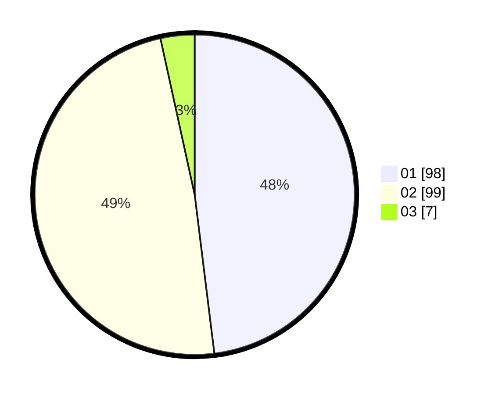

# Hasil

Hasil perolehan suara paslon dapat dilihat pada file paslon-01.txt, paslon-02.txt, dan paslon-03.txt.

Jika tidak ada, artinya data tersebut belum ada pada SIREKAP.

## Perolehan Suara

 * Paslon 01: **98**.
 * Paslon 02: **99**.
 * Paslon 03: **7**.

## Foto C Plano

https://sirekap-obj-formc.kpu.go.id/bdad/pemilu/ppwp/31/72/02/10/01/3172021001089-20240215-001256--7a9b86c7-d572-4767-a557-79d99a1e4b47.jpg

https://sirekap-obj-formc.kpu.go.id/bdad/pemilu/ppwp/31/72/02/10/01/3172021001089-20240215-001535--072633f2-a418-4540-9aa8-f5985b680ef4.jpg
