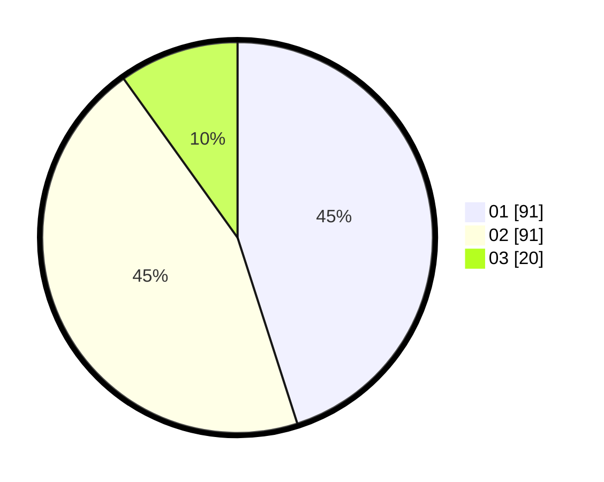

# Hasil

Hasil perolehan suara paslon dapat dilihat pada file paslon-01.txt, paslon-02.txt, dan paslon-03.txt.

Jika tidak ada, artinya data tersebut belum ada pada SIREKAP.

## Perolehan Suara

 * Paslon 01: **91**.
 * Paslon 02: **91**.
 * Paslon 03: **20**.

## Foto C Plano

https://sirekap-obj-formc.kpu.go.id/e909/pemilu/ppwp/31/72/02/10/01/3172021001092-20240214-193014--4b991935-2766-4e40-a486-746f9dfe7c30.jpg

https://sirekap-obj-formc.kpu.go.id/e909/pemilu/ppwp/31/72/02/10/01/3172021001092-20240215-003354--976a33ba-2c48-4692-8153-9d5b27d775bd.jpg
