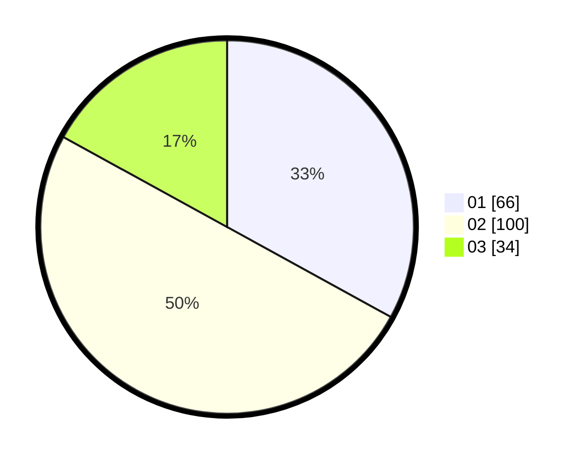

# Hasil

Hasil perolehan suara paslon dapat dilihat pada file paslon-01.txt, paslon-02.txt, dan paslon-03.txt.

Jika tidak ada, artinya data tersebut belum ada pada SIREKAP.

## Perolehan Suara

 * Paslon 01: **66**.
 * Paslon 02: **100**.
 * Paslon 03: **34**.

## Foto C Plano

https://sirekap-obj-formc.kpu.go.id/53e9/pemilu/ppwp/31/72/02/10/01/3172021001095-20240214-191807--07ed5a4c-3d60-4101-9868-b211abdc8d02.jpg

https://sirekap-obj-formc.kpu.go.id/53e9/pemilu/ppwp/31/72/02/10/01/3172021001095-20240214-192033--47c1a85f-0c9b-4732-862c-850835a202f4.jpg

https://sirekap-obj-formc.kpu.go.id/53e9/pemilu/ppwp/31/72/02/10/01/3172021001095-20240214-190253--47bf0b79-643f-492a-b179-e92ffb5a2f95.jpg

## DATA PEMILIH TETAP

Jumlah pemilih dalam DPT: **282**.
 * L: **144**.
 * P: **138**.

## DATA PENGGUNA HAK PILIH

Jumlah pengguna hak pilih dalam DPT: **190**.
 * L: **87**.
 * P: **103**.

Jumlah pengguna hak pilih dalam DPTb: **4**.
 * L: **2**.
 * P: **2**.

Jumlah pengguna hak pilih dalam DPK: **0**.
 * L: **0**.
 * P: **0**.

Jumlah pengguna hak pilih: **194**.
 * L: **89**.
 * P: **105**.

## JUMLAH SUARA SAH DAN TIDAK SAH

JUMLAH SELURUH SUARA SAH: **200**.

JUMLAH SUARA TIDAK SAH: **1**.

JUMLAH SELURUH SUARA SAH DAN SUARA TIDAK SAH: **201**.
