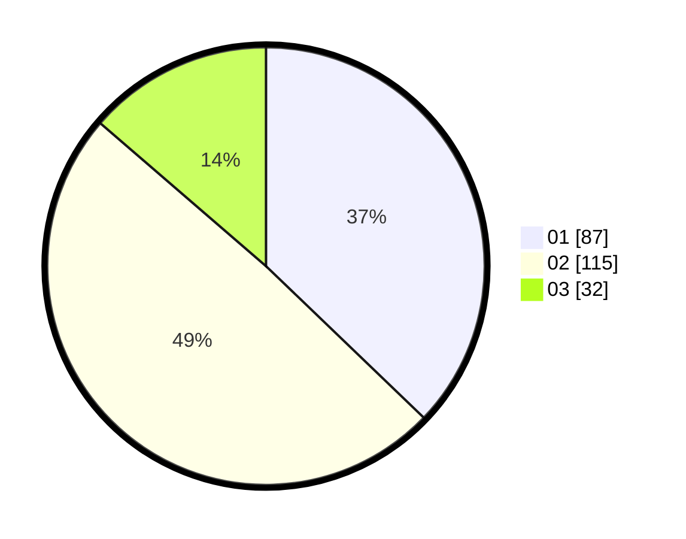

# Hasil

Hasil perolehan suara paslon dapat dilihat pada file paslon-01.txt, paslon-02.txt, dan paslon-03.txt.

Jika tidak ada, artinya data tersebut belum ada pada SIREKAP.

## Perolehan Suara

 * Paslon 01: **87**.
 * Paslon 02: **115**.
 * Paslon 03: **32**.

## Foto C Plano

https://sirekap-obj-formc.kpu.go.id/97c5/pemilu/ppwp/31/72/02/10/01/3172021001103-20240215-031836--0c90ca4b-6835-4b7d-aba2-9578d55d7cbe.jpg

https://sirekap-obj-formc.kpu.go.id/97c5/pemilu/ppwp/31/72/02/10/01/3172021001103-20240215-031857--d96ce5de-109b-41e3-ba0b-8a1f0e557769.jpg

https://sirekap-obj-formc.kpu.go.id/97c5/pemilu/ppwp/31/72/02/10/01/3172021001103-20240215-031918--09593e7e-f7bb-489e-b4f1-539e9d206bd7.jpg

## DATA PEMILIH TETAP

Jumlah pemilih dalam DPT: **285**.
 * L: **154**.
 * P: **131**.

## DATA PENGGUNA HAK PILIH

Jumlah pengguna hak pilih dalam DPT: **237**.
 * L: **127**.
 * P: **110**.

Jumlah pengguna hak pilih dalam DPTb: **0**.
 * L: **0**.
 * P: **0**.

Jumlah pengguna hak pilih dalam DPK: **0**.
 * L: **0**.
 * P: **0**.

Jumlah pengguna hak pilih: **237**.
 * L: **127**.
 * P: **110**.

## JUMLAH SUARA SAH DAN TIDAK SAH

JUMLAH SELURUH SUARA SAH: **234**.

JUMLAH SUARA TIDAK SAH: **3**.

JUMLAH SELURUH SUARA SAH DAN SUARA TIDAK SAH: **237**.
