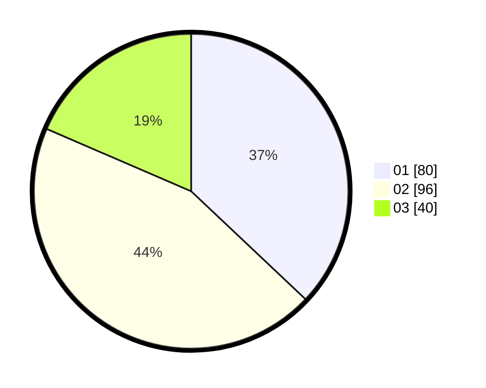

# Hasil

Hasil perolehan suara paslon dapat dilihat pada file paslon-01.txt, paslon-02.txt, dan paslon-03.txt.

Jika tidak ada, artinya data tersebut belum ada pada SIREKAP.

## Perolehan Suara

 * Paslon 01: **80**.
 * Paslon 02: **96**.
 * Paslon 03: **40**.

## Foto C Plano

https://sirekap-obj-formc.kpu.go.id/6e93/pemilu/ppwp/31/72/02/10/01/3172021001105-20240214-185205--7780f4bb-6db0-45eb-ab34-5068936abf9d.jpg

https://sirekap-obj-formc.kpu.go.id/6e93/pemilu/ppwp/31/72/02/10/01/3172021001105-20240214-185225--816f1328-ea0f-4461-b047-349c3380b7a3.jpg

https://sirekap-obj-formc.kpu.go.id/6e93/pemilu/ppwp/31/72/02/10/01/3172021001105-20240214-185242--8a3bd0d8-ca0a-4f5b-b4aa-85b328ba55a5.jpg

## DATA PEMILIH TETAP

Jumlah pemilih dalam DPT: **274**.
 * L: **137**.
 * P: **137**.

## DATA PENGGUNA HAK PILIH

Jumlah pengguna hak pilih dalam DPT: **215**.
 * L: **108**.
 * P: **107**.

Jumlah pengguna hak pilih dalam DPTb: **0**.
 * L: **0**.
 * P: **0**.

Jumlah pengguna hak pilih dalam DPK: **2**.
 * L: **2**.
 * P: **0**.

Jumlah pengguna hak pilih: **217**.
 * L: **110**.
 * P: **107**.

## JUMLAH SUARA SAH DAN TIDAK SAH

JUMLAH SELURUH SUARA SAH: **216**.

JUMLAH SUARA TIDAK SAH: **1**.

JUMLAH SELURUH SUARA SAH DAN SUARA TIDAK SAH: **217**.
