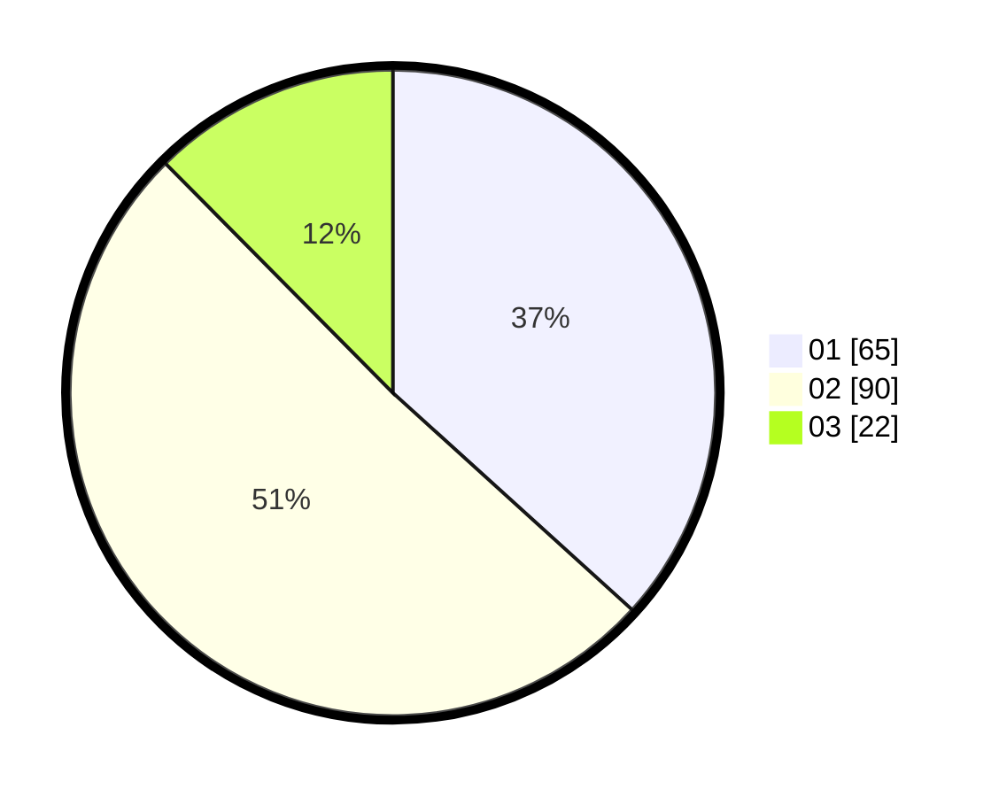

# Hasil

Hasil perolehan suara paslon dapat dilihat pada file paslon-01.txt, paslon-02.txt, dan paslon-03.txt.

Jika tidak ada, artinya data tersebut belum ada pada SIREKAP.

## Perolehan Suara

 * Paslon 01: **65**.
 * Paslon 02: **90**.
 * Paslon 03: **22**.

## Foto C Plano

https://sirekap-obj-formc.kpu.go.id/9693/pemilu/ppwp/31/72/02/10/01/3172021001114-20240214-200221--5ebf1a36-ef40-4703-aa47-f413e4207e8c.jpg

https://sirekap-obj-formc.kpu.go.id/9693/pemilu/ppwp/31/72/02/10/01/3172021001114-20240214-200024--8a664ca8-c69a-42ab-bb03-0ae6ce365e18.jpg
