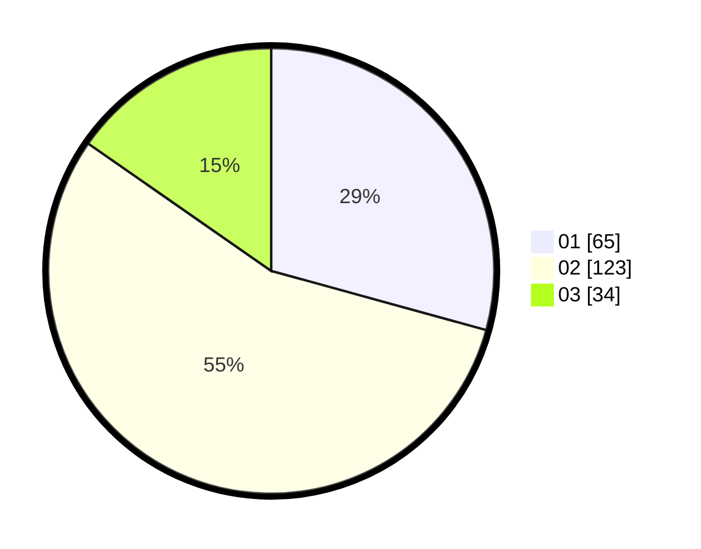

# Hasil

Hasil perolehan suara paslon dapat dilihat pada file paslon-01.txt, paslon-02.txt, dan paslon-03.txt.

Jika tidak ada, artinya data tersebut belum ada pada SIREKAP.

## Perolehan Suara

 * Paslon 01: **65**.
 * Paslon 02: **123**.
 * Paslon 03: **34**.

## Foto C Plano

https://sirekap-obj-formc.kpu.go.id/a6d1/pemilu/ppwp/31/72/02/10/02/3172021002003-20240217-103342--4f406961-7b9b-4824-8844-603be866ef6b.jpg

https://sirekap-obj-formc.kpu.go.id/a6d1/pemilu/ppwp/31/72/02/10/02/3172021002003-20240217-103406--abeffa00-5cf5-442e-ae42-5748fd6e76ec.jpg

https://sirekap-obj-formc.kpu.go.id/a6d1/pemilu/ppwp/31/72/02/10/02/3172021002003-20240217-103430--c80ea2c4-13c3-45eb-9de3-b03f4b8e0692.jpg

## DATA PEMILIH TETAP

Jumlah pemilih dalam DPT: **279**.
 * L: **134**.
 * P: **145**.

## DATA PENGGUNA HAK PILIH

Jumlah pengguna hak pilih dalam DPT: **225**.
 * L: **106**.
 * P: **119**.

Jumlah pengguna hak pilih dalam DPTb: **0**.
 * L: **0**.
 * P: **0**.

Jumlah pengguna hak pilih dalam DPK: **0**.
 * L: **0**.
 * P: **0**.

Jumlah pengguna hak pilih: **225**.
 * L: **106**.
 * P: **119**.

## JUMLAH SUARA SAH DAN TIDAK SAH

JUMLAH SELURUH SUARA SAH: **222**.

JUMLAH SUARA TIDAK SAH: **3**.

JUMLAH SELURUH SUARA SAH DAN SUARA TIDAK SAH: **225**.
