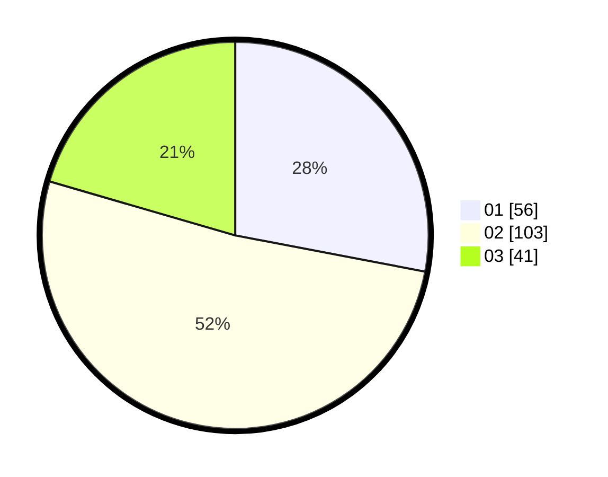

# Hasil

Hasil perolehan suara paslon dapat dilihat pada file paslon-01.txt, paslon-02.txt, dan paslon-03.txt.

Jika tidak ada, artinya data tersebut belum ada pada SIREKAP.

## Perolehan Suara

 * Paslon 01: **56**.
 * Paslon 02: **103**.
 * Paslon 03: **41**.

## Foto C Plano

https://sirekap-obj-formc.kpu.go.id/60a6/pemilu/ppwp/31/72/02/10/02/3172021002006-20240217-105020--b086a71e-5f7c-4932-a6f1-0a4fca586869.jpg

https://sirekap-obj-formc.kpu.go.id/60a6/pemilu/ppwp/31/72/02/10/02/3172021002006-20240217-105045--c030b29e-2b15-4d63-8e4f-699b01263e9b.jpg

https://sirekap-obj-formc.kpu.go.id/60a6/pemilu/ppwp/31/72/02/10/02/3172021002006-20240217-105109--30e0ed51-688a-473a-90d6-45666abf3cb4.jpg

## DATA PEMILIH TETAP

Jumlah pemilih dalam DPT: **283**.
 * L: **139**.
 * P: **144**.

## DATA PENGGUNA HAK PILIH

Jumlah pengguna hak pilih dalam DPT: **198**.
 * L: **93**.
 * P: **105**.

Jumlah pengguna hak pilih dalam DPTb: **1**.
 * L: **1**.
 * P: **0**.

Jumlah pengguna hak pilih dalam DPK: **4**.
 * L: **2**.
 * P: **2**.

Jumlah pengguna hak pilih: **203**.
 * L: **96**.
 * P: **107**.

## JUMLAH SUARA SAH DAN TIDAK SAH

JUMLAH SELURUH SUARA SAH: **200**.

JUMLAH SUARA TIDAK SAH: **3**.

JUMLAH SELURUH SUARA SAH DAN SUARA TIDAK SAH: **203**.
