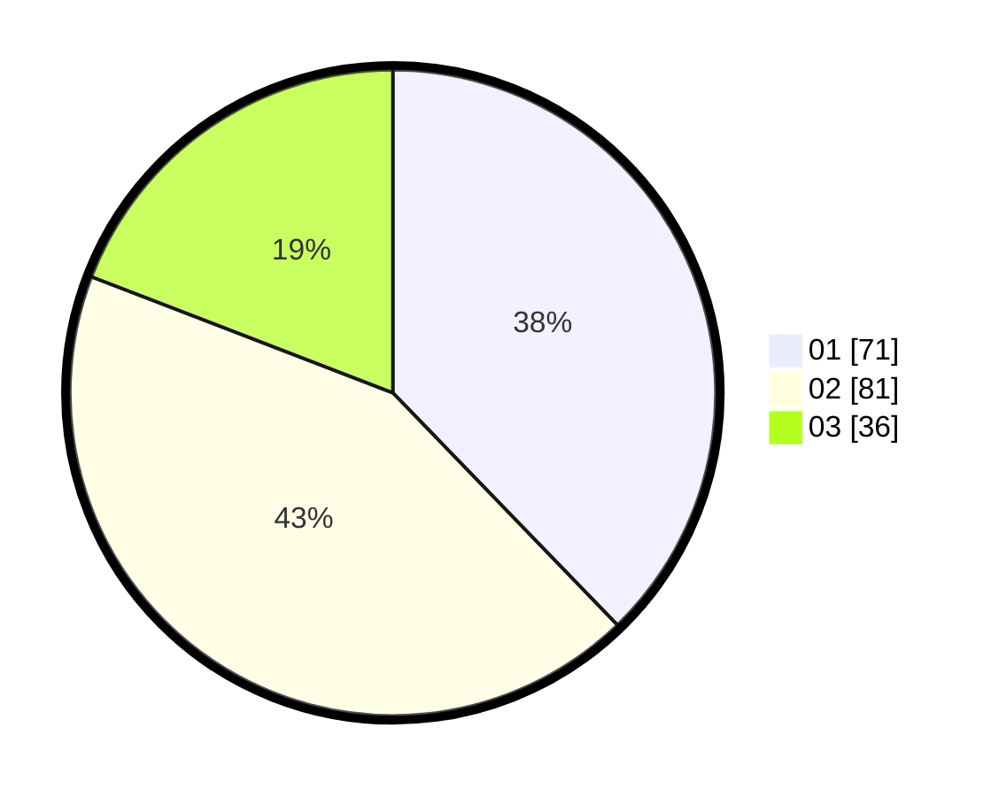

# Hasil

Hasil perolehan suara paslon dapat dilihat pada file paslon-01.txt, paslon-02.txt, dan paslon-03.txt.

Jika tidak ada, artinya data tersebut belum ada pada SIREKAP.

## Perolehan Suara

 * Paslon 01: **71**.
 * Paslon 02: **81**.
 * Paslon 03: **36**.

## Foto C Plano

https://sirekap-obj-formc.kpu.go.id/a566/pemilu/ppwp/31/72/02/10/02/3172021002007-20240217-105758--d4b637a9-a3b9-433f-bd7c-cc33742bb8d7.jpg

https://sirekap-obj-formc.kpu.go.id/a566/pemilu/ppwp/31/72/02/10/02/3172021002007-20240217-105822--67de4554-cc39-4c77-8e8b-ed3146c50b11.jpg

https://sirekap-obj-formc.kpu.go.id/a566/pemilu/ppwp/31/72/02/10/02/3172021002007-20240217-105901--df97f9e5-29c5-43e7-ba33-5195f213f18f.jpg

## DATA PEMILIH TETAP

Jumlah pemilih dalam DPT: **280**.
 * L: **144**.
 * P: **136**.

## DATA PENGGUNA HAK PILIH

Jumlah pengguna hak pilih dalam DPT: **189**.
 * L: **92**.
 * P: **97**.

Jumlah pengguna hak pilih dalam DPTb: **2**.
 * L: **1**.
 * P: **1**.

Jumlah pengguna hak pilih dalam DPK: **1**.
 * L: **1**.
 * P: **0**.

Jumlah pengguna hak pilih: **192**.
 * L: **94**.
 * P: **98**.

## JUMLAH SUARA SAH DAN TIDAK SAH

JUMLAH SELURUH SUARA SAH: **188**.

JUMLAH SUARA TIDAK SAH: **4**.

JUMLAH SELURUH SUARA SAH DAN SUARA TIDAK SAH: **192**.
