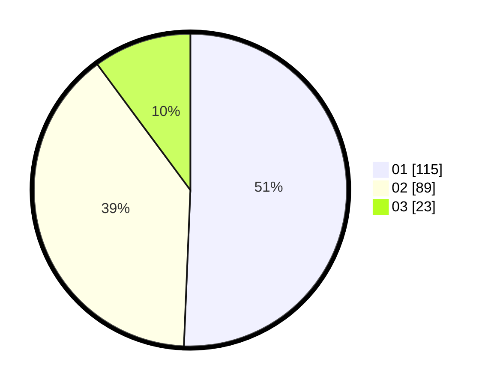

# Hasil

Hasil perolehan suara paslon dapat dilihat pada file paslon-01.txt, paslon-02.txt, dan paslon-03.txt.

Jika tidak ada, artinya data tersebut belum ada pada SIREKAP.

## Perolehan Suara

 * Paslon 01: **115**.
 * Paslon 02: **89**.
 * Paslon 03: **23**.

## Foto C Plano

https://sirekap-obj-formc.kpu.go.id/e2ce/pemilu/ppwp/31/72/02/10/02/3172021002009-20240217-111020--8567438e-a9b1-4382-b64a-4e579a9f06fb.jpg

https://sirekap-obj-formc.kpu.go.id/e2ce/pemilu/ppwp/31/72/02/10/02/3172021002009-20240217-111045--ad0539e6-9e23-4f8a-9e92-fe5d1eb830c1.jpg

https://sirekap-obj-formc.kpu.go.id/e2ce/pemilu/ppwp/31/72/02/10/02/3172021002009-20240217-111117--21691c14-1db0-433c-aacf-97ed7abc5d3f.jpg

## DATA PEMILIH TETAP

Jumlah pemilih dalam DPT: **286**.
 * L: **134**.
 * P: **152**.

## DATA PENGGUNA HAK PILIH

Jumlah pengguna hak pilih dalam DPT: **228**.
 * L: **110**.
 * P: **118**.

Jumlah pengguna hak pilih dalam DPTb: **0**.
 * L: **0**.
 * P: **0**.

Jumlah pengguna hak pilih dalam DPK: **6**.
 * L: **2**.
 * P: **4**.

Jumlah pengguna hak pilih: **234**.
 * L: **112**.
 * P: **122**.

## JUMLAH SUARA SAH DAN TIDAK SAH

JUMLAH SELURUH SUARA SAH: **227**.

JUMLAH SUARA TIDAK SAH: **7**.

JUMLAH SELURUH SUARA SAH DAN SUARA TIDAK SAH: **234**.
