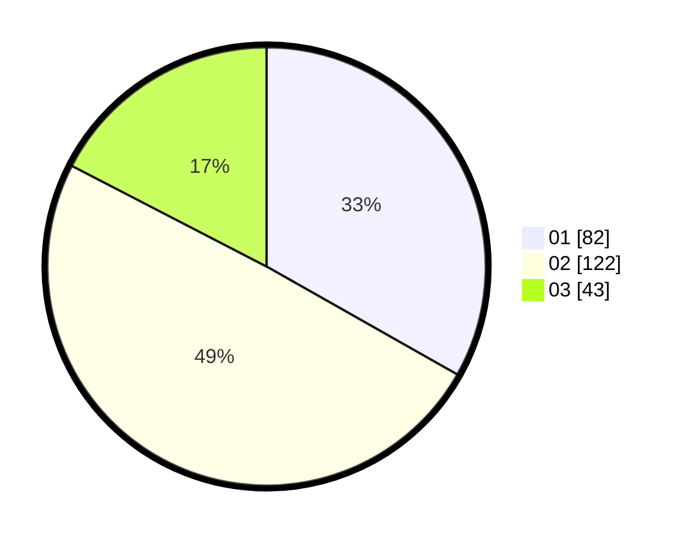

# Hasil

Hasil perolehan suara paslon dapat dilihat pada file paslon-01.txt, paslon-02.txt, dan paslon-03.txt.

Jika tidak ada, artinya data tersebut belum ada pada SIREKAP.

## Perolehan Suara

 * Paslon 01: **82**.
 * Paslon 02: **122**.
 * Paslon 03: **43**.

## Foto C Plano

https://sirekap-obj-formc.kpu.go.id/a238/pemilu/ppwp/31/72/02/10/02/3172021002011-20240217-113214--d601ff8f-b9e4-40d0-95f7-e30b61ef2829.jpg

https://sirekap-obj-formc.kpu.go.id/a238/pemilu/ppwp/31/72/02/10/02/3172021002011-20240217-113238--f4299c97-9ac3-47a0-a297-cf61d62b1ad1.jpg

https://sirekap-obj-formc.kpu.go.id/a238/pemilu/ppwp/31/72/02/10/02/3172021002011-20240217-113301--7fead049-8495-4387-b77b-2c505822adcf.jpg

## DATA PEMILIH TETAP

Jumlah pemilih dalam DPT: **289**.
 * L: **139**.
 * P: **150**.

## DATA PENGGUNA HAK PILIH

Jumlah pengguna hak pilih dalam DPT: **235**.
 * L: **111**.
 * P: **124**.

Jumlah pengguna hak pilih dalam DPTb: **9**.
 * L: **5**.
 * P: **4**.

Jumlah pengguna hak pilih dalam DPK: **4**.
 * L: **3**.
 * P: **1**.

Jumlah pengguna hak pilih: **248**.
 * L: **119**.
 * P: **129**.

## JUMLAH SUARA SAH DAN TIDAK SAH

JUMLAH SELURUH SUARA SAH: **247**.

JUMLAH SUARA TIDAK SAH: **1**.

JUMLAH SELURUH SUARA SAH DAN SUARA TIDAK SAH: **248**.
