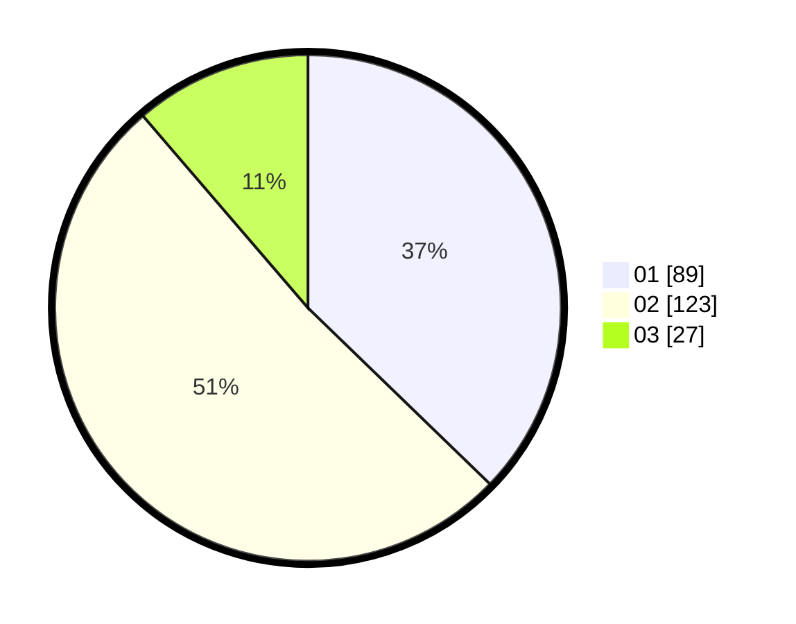

# Hasil

Hasil perolehan suara paslon dapat dilihat pada file paslon-01.txt, paslon-02.txt, dan paslon-03.txt.

Jika tidak ada, artinya data tersebut belum ada pada SIREKAP.

## Perolehan Suara

 * Paslon 01: **89**.
 * Paslon 02: **123**.
 * Paslon 03: **27**.

## Foto C Plano

https://sirekap-obj-formc.kpu.go.id/41e4/pemilu/ppwp/31/72/02/10/02/3172021002016-20240217-135845--9c70c7f5-0815-4156-a5f4-e2244b59d97c.jpg

https://sirekap-obj-formc.kpu.go.id/41e4/pemilu/ppwp/31/72/02/10/02/3172021002016-20240217-135934--dc0e314f-d14c-4247-8dda-b2dec7dcb8ab.jpg

https://sirekap-obj-formc.kpu.go.id/41e4/pemilu/ppwp/31/72/02/10/02/3172021002016-20240217-135956--371af0d6-1a39-4dc8-9a09-58bfa7041931.jpg

## DATA PEMILIH TETAP

Jumlah pemilih dalam DPT: **286**.
 * L: **147**.
 * P: **139**.

## DATA PENGGUNA HAK PILIH

Jumlah pengguna hak pilih dalam DPT: **235**.
 * L: **120**.
 * P: **115**.

Jumlah pengguna hak pilih dalam DPTb: **4**.
 * L: **2**.
 * P: **2**.

Jumlah pengguna hak pilih dalam DPK: **3**.
 * L: **2**.
 * P: **1**.

Jumlah pengguna hak pilih: **242**.
 * L: **124**.
 * P: **118**.

## JUMLAH SUARA SAH DAN TIDAK SAH

JUMLAH SELURUH SUARA SAH: **239**.

JUMLAH SUARA TIDAK SAH: **3**.

JUMLAH SELURUH SUARA SAH DAN SUARA TIDAK SAH: **242**.
