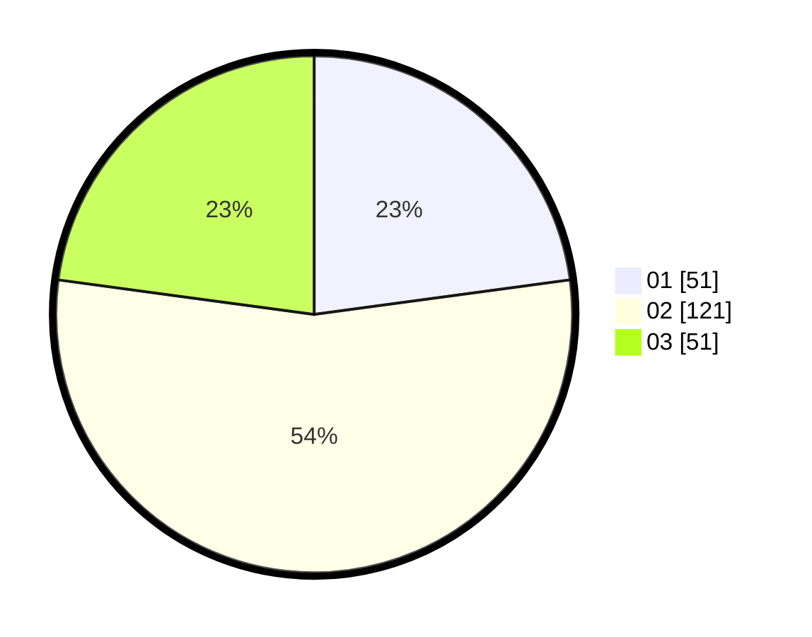

# Hasil

Hasil perolehan suara paslon dapat dilihat pada file paslon-01.txt, paslon-02.txt, dan paslon-03.txt.

Jika tidak ada, artinya data tersebut belum ada pada SIREKAP.

## Perolehan Suara

 * Paslon 01: **51**.
 * Paslon 02: **121**.
 * Paslon 03: **51**.

## Foto C Plano

https://sirekap-obj-formc.kpu.go.id/2945/pemilu/ppwp/31/72/02/10/02/3172021002019-20240217-142155--dca5cf38-8380-472a-9b20-8c10c51adde1.jpg

https://sirekap-obj-formc.kpu.go.id/2945/pemilu/ppwp/31/72/02/10/02/3172021002019-20240217-142217--e9c75c37-fa1a-4d5f-8608-a42ca96adbe6.jpg

https://sirekap-obj-formc.kpu.go.id/2945/pemilu/ppwp/31/72/02/10/02/3172021002019-20240217-142251--af697494-4b25-4a8c-b6fd-2df2fb67e215.jpg

## DATA PEMILIH TETAP

Jumlah pemilih dalam DPT: **283**.
 * L: **145**.
 * P: **138**.

## DATA PENGGUNA HAK PILIH

Jumlah pengguna hak pilih dalam DPT: **217**.
 * L: **102**.
 * P: **115**.

Jumlah pengguna hak pilih dalam DPTb: **5**.
 * L: **3**.
 * P: **2**.

Jumlah pengguna hak pilih dalam DPK: **7**.
 * L: **3**.
 * P: **4**.

Jumlah pengguna hak pilih: **229**.
 * L: **108**.
 * P: **121**.

## JUMLAH SUARA SAH DAN TIDAK SAH

JUMLAH SELURUH SUARA SAH: **223**.

JUMLAH SUARA TIDAK SAH: **6**.

JUMLAH SELURUH SUARA SAH DAN SUARA TIDAK SAH: **229**.
