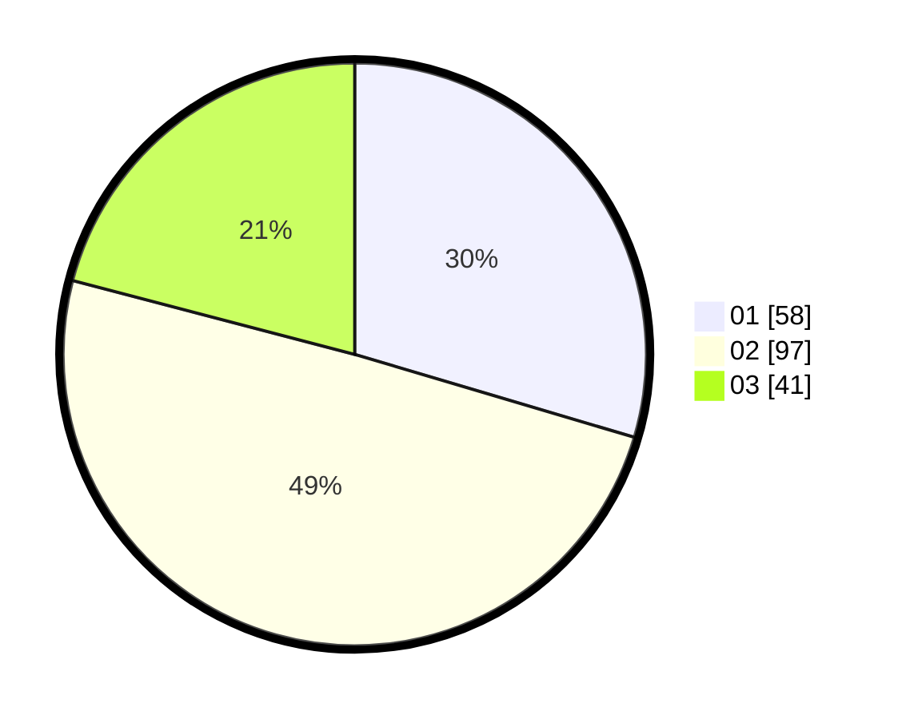

# Hasil

Hasil perolehan suara paslon dapat dilihat pada file paslon-01.txt, paslon-02.txt, dan paslon-03.txt.

Jika tidak ada, artinya data tersebut belum ada pada SIREKAP.

## Perolehan Suara

 * Paslon 01: **58**.
 * Paslon 02: **97**.
 * Paslon 03: **41**.

## Foto C Plano

https://sirekap-obj-formc.kpu.go.id/9bbb/pemilu/ppwp/31/72/02/10/02/3172021002020-20240217-144207--2f798339-1aab-405a-a408-c2024139a7be.jpg

https://sirekap-obj-formc.kpu.go.id/9bbb/pemilu/ppwp/31/72/02/10/02/3172021002020-20240217-144235--df2aa2a7-d134-4bc7-a507-d513a6806e68.jpg

https://sirekap-obj-formc.kpu.go.id/9bbb/pemilu/ppwp/31/72/02/10/02/3172021002020-20240217-144256--838ad64b-6d5e-4a02-b523-682433338c4b.jpg

## DATA PEMILIH TETAP

Jumlah pemilih dalam DPT: **283**.
 * L: **145**.
 * P: **138**.

## DATA PENGGUNA HAK PILIH

Jumlah pengguna hak pilih dalam DPT: **199**.
 * L: **100**.
 * P: **99**.

Jumlah pengguna hak pilih dalam DPTb: **2**.
 * L: **1**.
 * P: **1**.

Jumlah pengguna hak pilih dalam DPK: **0**.
 * L: **0**.
 * P: **0**.

Jumlah pengguna hak pilih: **201**.
 * L: **101**.
 * P: **100**.

## JUMLAH SUARA SAH DAN TIDAK SAH

JUMLAH SELURUH SUARA SAH: **196**.

JUMLAH SUARA TIDAK SAH: **5**.

JUMLAH SELURUH SUARA SAH DAN SUARA TIDAK SAH: **201**.
