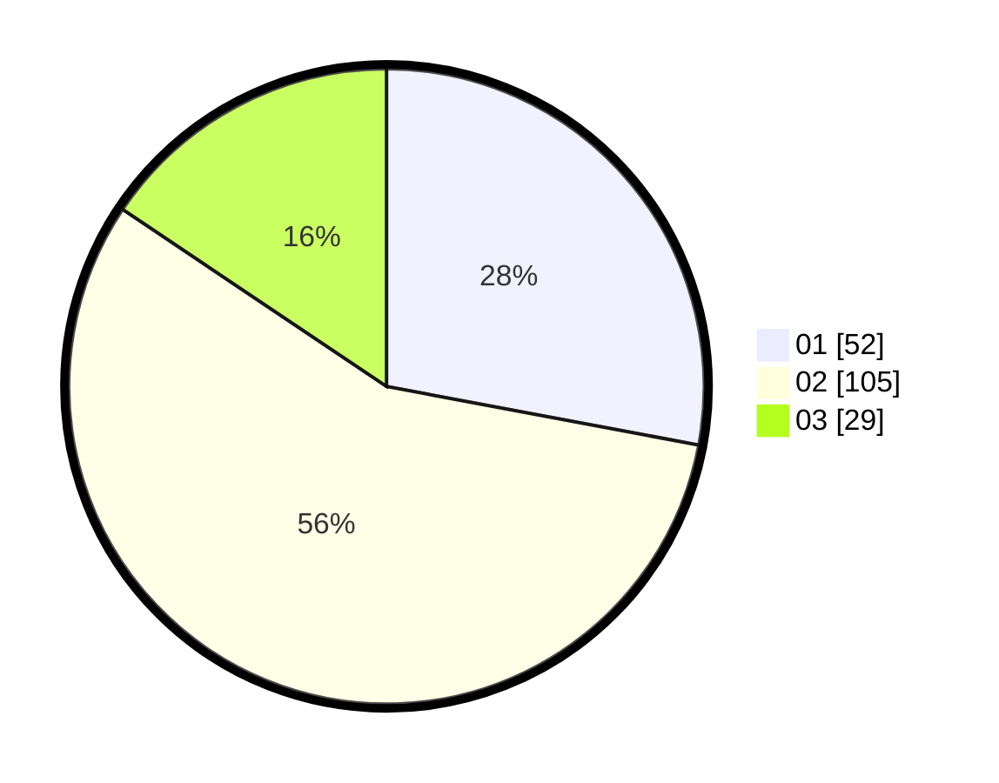

# Hasil

Hasil perolehan suara paslon dapat dilihat pada file paslon-01.txt, paslon-02.txt, dan paslon-03.txt.

Jika tidak ada, artinya data tersebut belum ada pada SIREKAP.

## Perolehan Suara

 * Paslon 01: **52**.
 * Paslon 02: **105**.
 * Paslon 03: **29**.

## Foto C Plano

https://sirekap-obj-formc.kpu.go.id/440d/pemilu/ppwp/31/72/02/10/02/3172021002022-20240217-144828--9e73d87c-81f2-4d1e-97db-ac0b9ae1d878.jpg

https://sirekap-obj-formc.kpu.go.id/440d/pemilu/ppwp/31/72/02/10/02/3172021002022-20240217-144850--96952bf6-f17b-406b-bfe8-93985ab71b6f.jpg

https://sirekap-obj-formc.kpu.go.id/440d/pemilu/ppwp/31/72/02/10/02/3172021002022-20240217-144919--ebf2f8d4-75b6-4cfd-8a56-4b890d47950d.jpg

## DATA PEMILIH TETAP

Jumlah pemilih dalam DPT: **290**.
 * L: **138**.
 * P: **152**.

## DATA PENGGUNA HAK PILIH

Jumlah pengguna hak pilih dalam DPT: **188**.
 * L: **88**.
 * P: **100**.

Jumlah pengguna hak pilih dalam DPTb: **0**.
 * L: **0**.
 * P: **0**.

Jumlah pengguna hak pilih dalam DPK: **1**.
 * L: **1**.
 * P: **0**.

Jumlah pengguna hak pilih: **189**.
 * L: **89**.
 * P: **100**.

## JUMLAH SUARA SAH DAN TIDAK SAH

JUMLAH SELURUH SUARA SAH: **186**.

JUMLAH SUARA TIDAK SAH: **3**.

JUMLAH SELURUH SUARA SAH DAN SUARA TIDAK SAH: **189**.
