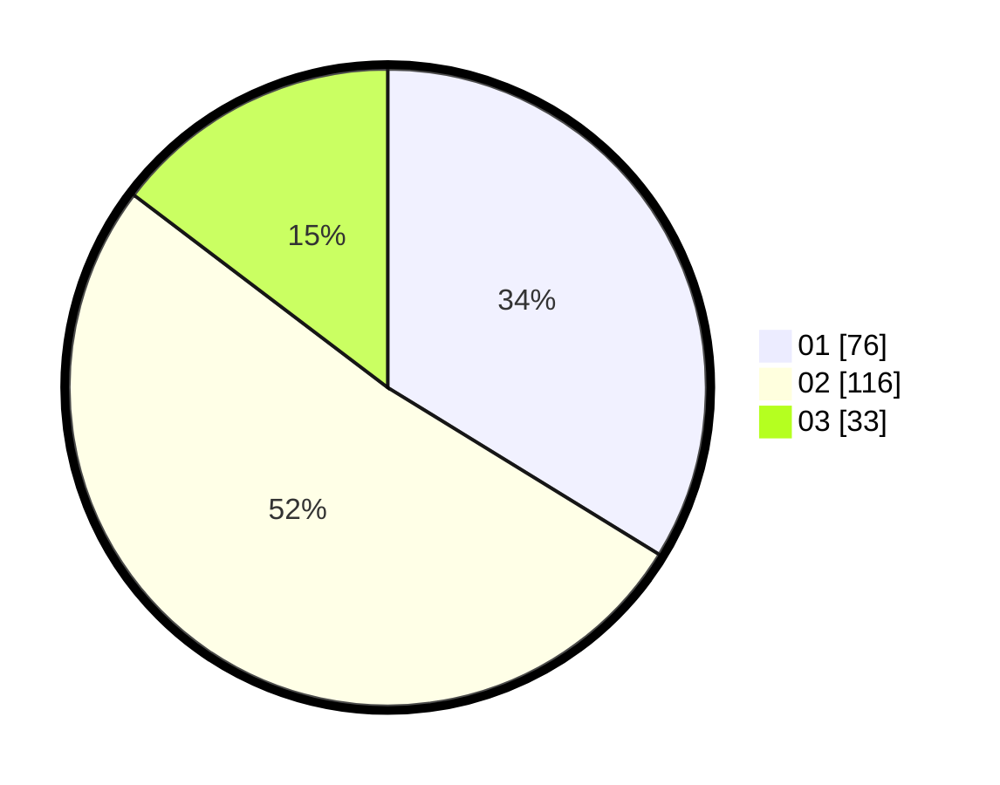

# Hasil

Hasil perolehan suara paslon dapat dilihat pada file paslon-01.txt, paslon-02.txt, dan paslon-03.txt.

Jika tidak ada, artinya data tersebut belum ada pada SIREKAP.

## Perolehan Suara

 * Paslon 01: **76**.
 * Paslon 02: **116**.
 * Paslon 03: **33**.

## Foto C Plano

https://sirekap-obj-formc.kpu.go.id/f65b/pemilu/ppwp/31/72/02/10/02/3172021002026-20240217-152929--4d17abfa-a72c-4067-9c86-33f8df7ff19e.jpg

https://sirekap-obj-formc.kpu.go.id/f65b/pemilu/ppwp/31/72/02/10/02/3172021002026-20240217-152956--377cb927-9acc-4e70-8192-c50556988875.jpg

https://sirekap-obj-formc.kpu.go.id/f65b/pemilu/ppwp/31/72/02/10/02/3172021002026-20240217-153026--55223954-257c-4dd6-86b5-9246ad8be886.jpg

## DATA PEMILIH TETAP

Jumlah pemilih dalam DPT: **229**.
 * L: **103**.
 * P: **126**.

## DATA PENGGUNA HAK PILIH

Jumlah pengguna hak pilih dalam DPT: **228**.
 * L: **102**.
 * P: **126**.

Jumlah pengguna hak pilih dalam DPTb: **0**.
 * L: **0**.
 * P: **0**.

Jumlah pengguna hak pilih dalam DPK: **1**.
 * L: **1**.
 * P: **0**.

Jumlah pengguna hak pilih: **229**.
 * L: **103**.
 * P: **126**.

## JUMLAH SUARA SAH DAN TIDAK SAH

JUMLAH SELURUH SUARA SAH: **225**.

JUMLAH SUARA TIDAK SAH: **4**.

JUMLAH SELURUH SUARA SAH DAN SUARA TIDAK SAH: **229**.
