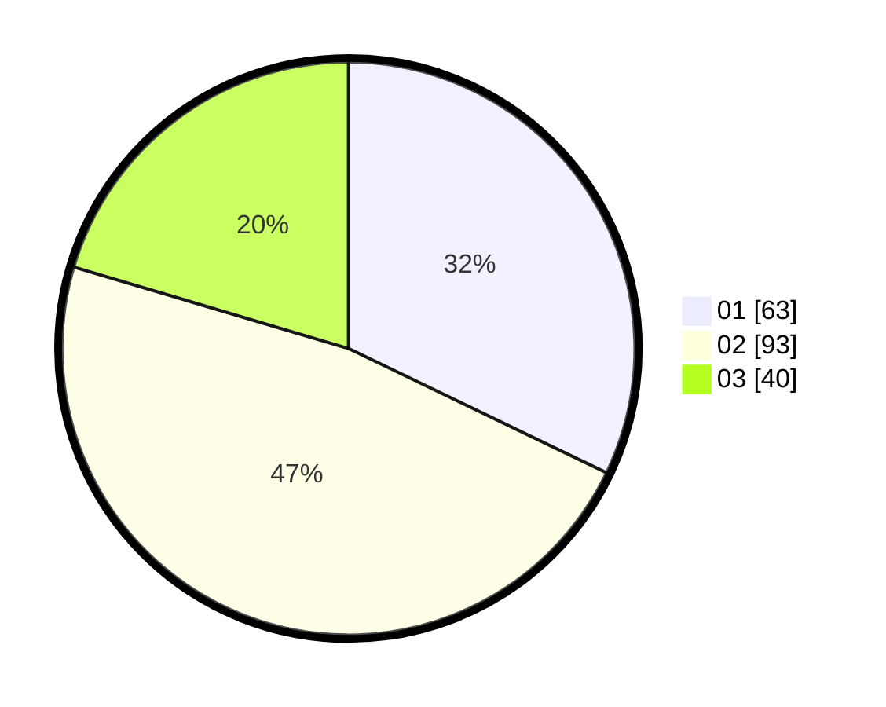

# Hasil

Hasil perolehan suara paslon dapat dilihat pada file paslon-01.txt, paslon-02.txt, dan paslon-03.txt.

Jika tidak ada, artinya data tersebut belum ada pada SIREKAP.

## Perolehan Suara

 * Paslon 01: **63**.
 * Paslon 02: **93**.
 * Paslon 03: **40**.

## Foto C Plano

https://sirekap-obj-formc.kpu.go.id/c465/pemilu/ppwp/31/72/02/10/02/3172021002028-20240217-164230--fa02af13-a390-4bfa-bf73-38f616cf8e21.jpg

https://sirekap-obj-formc.kpu.go.id/c465/pemilu/ppwp/31/72/02/10/02/3172021002028-20240217-164252--c7180f4d-359d-4a42-bd83-d477aecc6f36.jpg

https://sirekap-obj-formc.kpu.go.id/c465/pemilu/ppwp/31/72/02/10/02/3172021002028-20240217-164313--270cde36-2d01-4822-91a4-04b93b799e70.jpg

## DATA PEMILIH TETAP

Jumlah pemilih dalam DPT: **287**.
 * L: **153**.
 * P: **134**.

## DATA PENGGUNA HAK PILIH

Jumlah pengguna hak pilih dalam DPT: **199**.
 * L: **102**.
 * P: **97**.

Jumlah pengguna hak pilih dalam DPTb: **0**.
 * L: **0**.
 * P: **0**.

Jumlah pengguna hak pilih dalam DPK: **1**.
 * L: **0**.
 * P: **1**.

Jumlah pengguna hak pilih: **200**.
 * L: **102**.
 * P: **98**.

## JUMLAH SUARA SAH DAN TIDAK SAH

JUMLAH SELURUH SUARA SAH: **196**.

JUMLAH SUARA TIDAK SAH: **4**.

JUMLAH SELURUH SUARA SAH DAN SUARA TIDAK SAH: **200**.
