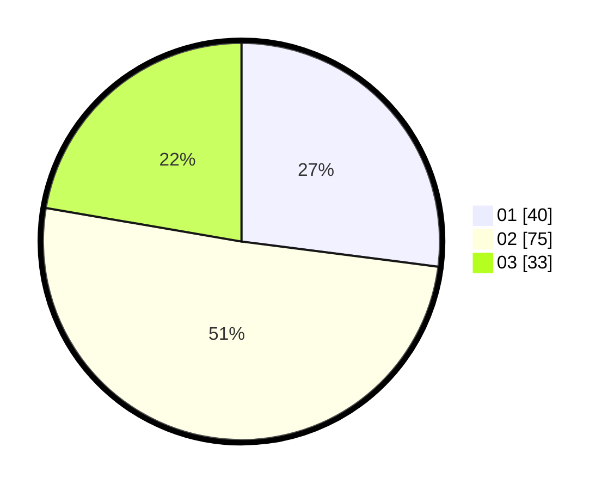

# Hasil

Hasil perolehan suara paslon dapat dilihat pada file paslon-01.txt, paslon-02.txt, dan paslon-03.txt.

Jika tidak ada, artinya data tersebut belum ada pada SIREKAP.

## Perolehan Suara

 * Paslon 01: **40**.
 * Paslon 02: **75**.
 * Paslon 03: **33**.

## Foto C Plano

https://sirekap-obj-formc.kpu.go.id/724d/pemilu/ppwp/31/72/02/10/02/3172021002029-20240217-201539--aae91b02-280d-4816-ae5c-84c7bb7ed6a9.jpg

https://sirekap-obj-formc.kpu.go.id/724d/pemilu/ppwp/31/72/02/10/02/3172021002029-20240217-201625--cf740347-6bb0-4b2e-92a7-5e6b2a8f0095.jpg

https://sirekap-obj-formc.kpu.go.id/724d/pemilu/ppwp/31/72/02/10/02/3172021002029-20240217-201657--9d42359a-e932-4edd-9b6b-fd2a85dbf9a7.jpg

## DATA PEMILIH TETAP

Jumlah pemilih dalam DPT: **205**.
 * L: **108**.
 * P: **97**.

## DATA PENGGUNA HAK PILIH

Jumlah pengguna hak pilih dalam DPT: **145**.
 * L: **71**.
 * P: **74**.

Jumlah pengguna hak pilih dalam DPTb: **3**.
 * L: **0**.
 * P: **3**.

Jumlah pengguna hak pilih dalam DPK: **0**.
 * L: **0**.
 * P: **0**.

Jumlah pengguna hak pilih: **148**.
 * L: **71**.
 * P: **77**.

## JUMLAH SUARA SAH DAN TIDAK SAH

JUMLAH SELURUH SUARA SAH: **148**.

JUMLAH SUARA TIDAK SAH: **0**.

JUMLAH SELURUH SUARA SAH DAN SUARA TIDAK SAH: **148**.
