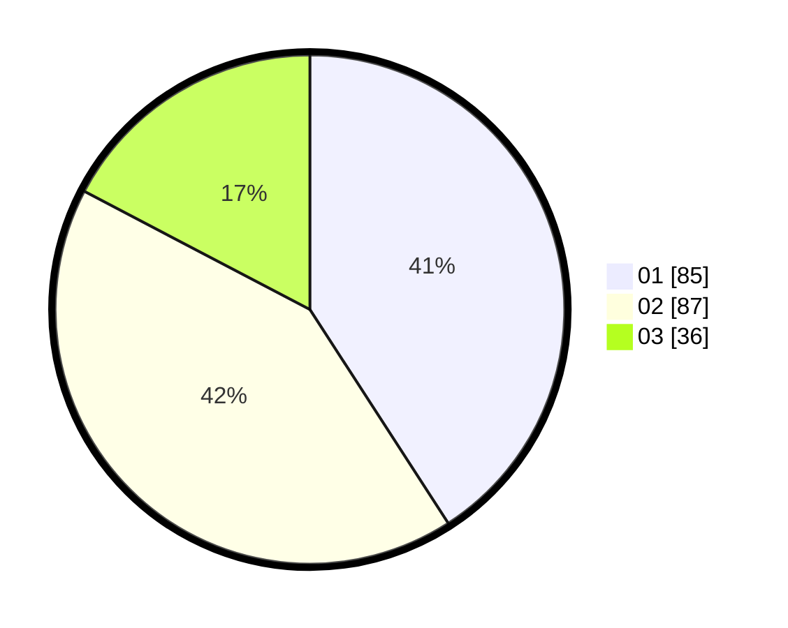

# Hasil

Hasil perolehan suara paslon dapat dilihat pada file paslon-01.txt, paslon-02.txt, dan paslon-03.txt.

Jika tidak ada, artinya data tersebut belum ada pada SIREKAP.

## Perolehan Suara

 * Paslon 01: **85**.
 * Paslon 02: **87**.
 * Paslon 03: **36**.

## Foto C Plano

https://sirekap-obj-formc.kpu.go.id/7527/pemilu/ppwp/31/72/02/10/02/3172021002035-20240217-172142--70be118b-a1bf-4d9f-845f-f6de7f2fd0a3.jpg

https://sirekap-obj-formc.kpu.go.id/7527/pemilu/ppwp/31/72/02/10/02/3172021002035-20240217-172221--8dd7b631-1430-45c1-87ab-6712c418ff8c.jpg

https://sirekap-obj-formc.kpu.go.id/7527/pemilu/ppwp/31/72/02/10/02/3172021002035-20240217-172321--b03e59e9-48a7-41d5-89a1-55eab11c221b.jpg

## DATA PEMILIH TETAP

Jumlah pemilih dalam DPT: **289**.
 * L: **146**.
 * P: **143**.

## DATA PENGGUNA HAK PILIH

Jumlah pengguna hak pilih dalam DPT: **207**.
 * L: **96**.
 * P: **111**.

Jumlah pengguna hak pilih dalam DPTb: **1**.
 * L: **1**.
 * P: **0**.

Jumlah pengguna hak pilih dalam DPK: **3**.
 * L: **2**.
 * P: **1**.

Jumlah pengguna hak pilih: **211**.
 * L: **99**.
 * P: **112**.

## JUMLAH SUARA SAH DAN TIDAK SAH

JUMLAH SELURUH SUARA SAH: **208**.

JUMLAH SUARA TIDAK SAH: **3**.

JUMLAH SELURUH SUARA SAH DAN SUARA TIDAK SAH: **211**.
