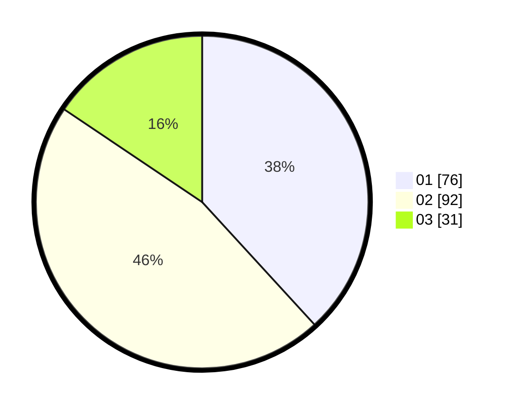

# Hasil

Hasil perolehan suara paslon dapat dilihat pada file paslon-01.txt, paslon-02.txt, dan paslon-03.txt.

Jika tidak ada, artinya data tersebut belum ada pada SIREKAP.

## Perolehan Suara

 * Paslon 01: **76**.
 * Paslon 02: **92**.
 * Paslon 03: **31**.

## Foto C Plano

https://sirekap-obj-formc.kpu.go.id/a739/pemilu/ppwp/31/72/02/10/02/3172021002037-20240217-173539--011f46cf-f381-481b-9445-d4db93c19f76.jpg

https://sirekap-obj-formc.kpu.go.id/a739/pemilu/ppwp/31/72/02/10/02/3172021002037-20240217-173633--41929e83-148d-4499-96c3-4e63bcd85fb2.jpg

https://sirekap-obj-formc.kpu.go.id/a739/pemilu/ppwp/31/72/02/10/02/3172021002037-20240217-173607--e21f4753-d704-4202-911d-93f6d4e91ba8.jpg

## DATA PEMILIH TETAP

Jumlah pemilih dalam DPT: **287**.
 * L: **144**.
 * P: **143**.

## DATA PENGGUNA HAK PILIH

Jumlah pengguna hak pilih dalam DPT: **205**.
 * L: **100**.
 * P: **105**.

Jumlah pengguna hak pilih dalam DPTb: **0**.
 * L: **0**.
 * P: **0**.

Jumlah pengguna hak pilih dalam DPK: **0**.
 * L: **0**.
 * P: **0**.

Jumlah pengguna hak pilih: **205**.
 * L: **100**.
 * P: **105**.

## JUMLAH SUARA SAH DAN TIDAK SAH

JUMLAH SELURUH SUARA SAH: **199**.

JUMLAH SUARA TIDAK SAH: **6**.

JUMLAH SELURUH SUARA SAH DAN SUARA TIDAK SAH: **205**.
