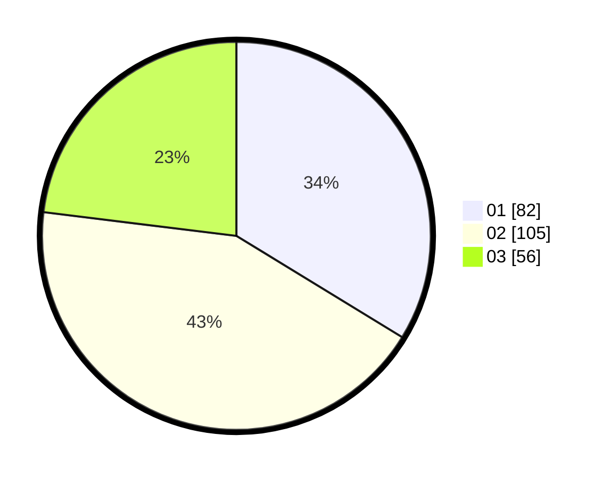

# Hasil

Hasil perolehan suara paslon dapat dilihat pada file paslon-01.txt, paslon-02.txt, dan paslon-03.txt.

Jika tidak ada, artinya data tersebut belum ada pada SIREKAP.

## Perolehan Suara

 * Paslon 01: **82**.
 * Paslon 02: **105**.
 * Paslon 03: **56**.

## Foto C Plano

https://sirekap-obj-formc.kpu.go.id/24e4/pemilu/ppwp/31/72/02/10/02/3172021002040-20240217-174953--b587528d-3b4e-4895-8c52-2e8c10cd4434.jpg

https://sirekap-obj-formc.kpu.go.id/24e4/pemilu/ppwp/31/72/02/10/02/3172021002040-20240217-174931--d5c7d84e-5dae-421c-9a04-15913c7f7c64.jpg

https://sirekap-obj-formc.kpu.go.id/24e4/pemilu/ppwp/31/72/02/10/02/3172021002040-20240217-174905--7db86d87-bf2b-4f2f-9014-31b889a85b1f.jpg

## DATA PEMILIH TETAP

Jumlah pemilih dalam DPT: **284**.
 * L: **141**.
 * P: **143**.

## DATA PENGGUNA HAK PILIH

Jumlah pengguna hak pilih dalam DPT: **230**.
 * L: **106**.
 * P: **124**.

Jumlah pengguna hak pilih dalam DPTb: **10**.
 * L: **3**.
 * P: **7**.

Jumlah pengguna hak pilih dalam DPK: **5**.
 * L: **1**.
 * P: **4**.

Jumlah pengguna hak pilih: **245**.
 * L: **110**.
 * P: **135**.

## JUMLAH SUARA SAH DAN TIDAK SAH

JUMLAH SELURUH SUARA SAH: **243**.

JUMLAH SUARA TIDAK SAH: **2**.

JUMLAH SELURUH SUARA SAH DAN SUARA TIDAK SAH: **245**.
