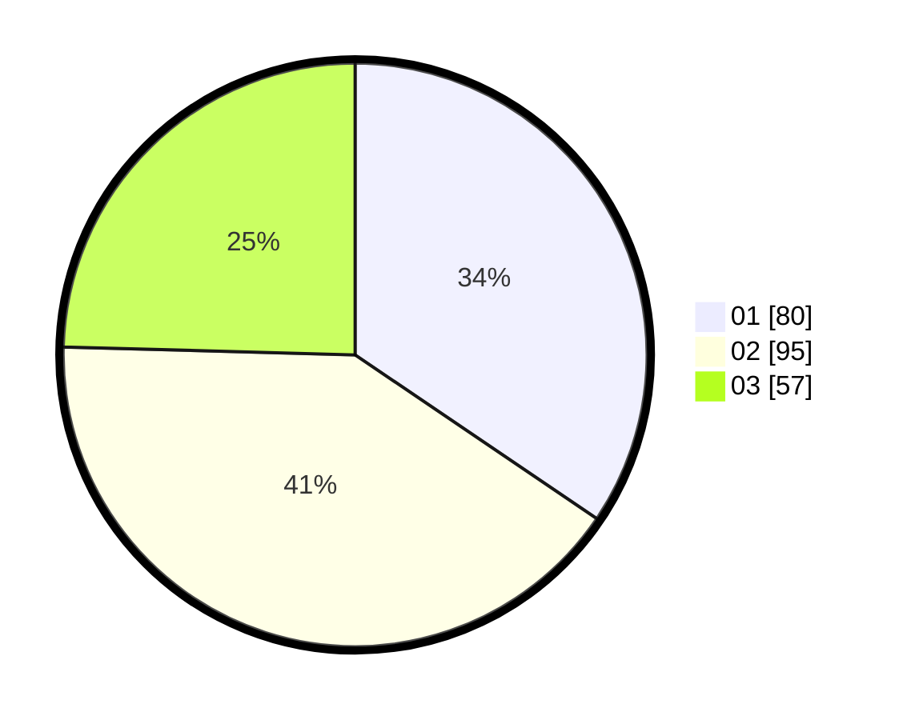

# Hasil

Hasil perolehan suara paslon dapat dilihat pada file paslon-01.txt, paslon-02.txt, dan paslon-03.txt.

Jika tidak ada, artinya data tersebut belum ada pada SIREKAP.

## Perolehan Suara

 * Paslon 01: **80**.
 * Paslon 02: **95**.
 * Paslon 03: **57**.

## Foto C Plano

https://sirekap-obj-formc.kpu.go.id/775a/pemilu/ppwp/31/72/02/10/02/3172021002045-20240214-184520--3a160186-8d61-4c21-9b57-71b7812180ba.jpg

https://sirekap-obj-formc.kpu.go.id/775a/pemilu/ppwp/31/72/02/10/02/3172021002045-20240214-184836--b86ba33f-5abe-45f9-b9d6-8cd3648e6854.jpg

https://sirekap-obj-formc.kpu.go.id/775a/pemilu/ppwp/31/72/02/10/02/3172021002045-20240214-185039--44d697a0-badd-4c89-96d2-02a8c2f0b0a4.jpg

## DATA PEMILIH TETAP

Jumlah pemilih dalam DPT: **290**.
 * L: **141**.
 * P: **149**.

## DATA PENGGUNA HAK PILIH

Jumlah pengguna hak pilih dalam DPT: **228**.
 * L: **111**.
 * P: **117**.

Jumlah pengguna hak pilih dalam DPTb: **4**.
 * L: **2**.
 * P: **2**.

Jumlah pengguna hak pilih dalam DPK: **2**.
 * L: **0**.
 * P: **2**.

Jumlah pengguna hak pilih: **234**.
 * L: **113**.
 * P: **121**.

## JUMLAH SUARA SAH DAN TIDAK SAH

JUMLAH SELURUH SUARA SAH: **232**.

JUMLAH SUARA TIDAK SAH: **2**.

JUMLAH SELURUH SUARA SAH DAN SUARA TIDAK SAH: **234**.
