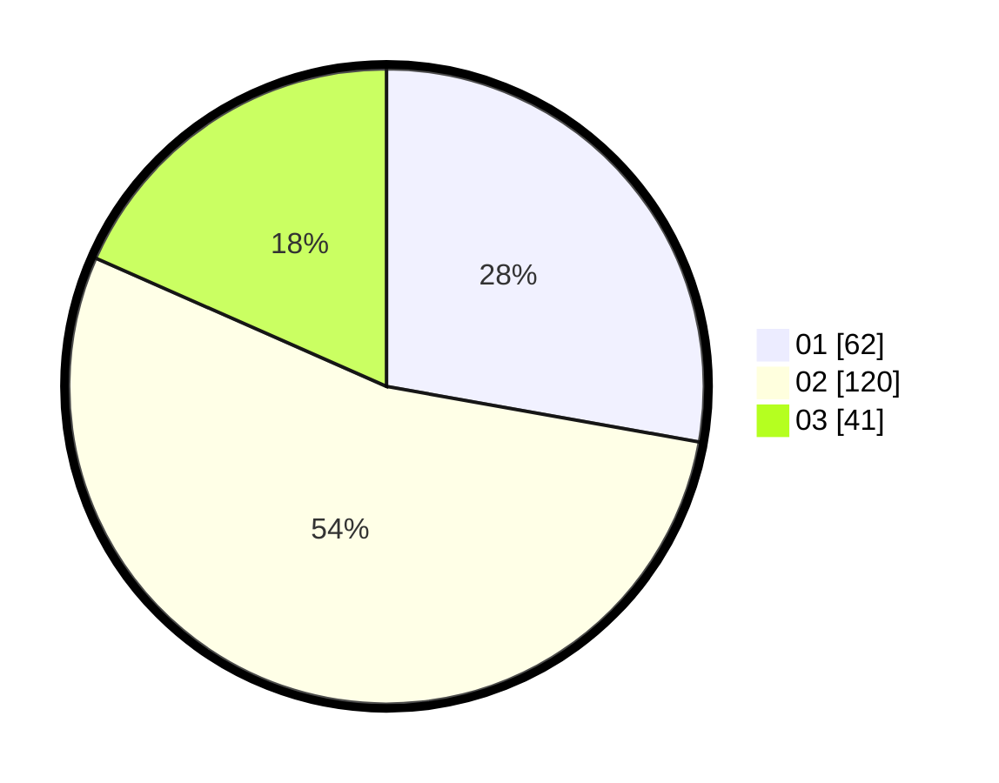

# Hasil

Hasil perolehan suara paslon dapat dilihat pada file paslon-01.txt, paslon-02.txt, dan paslon-03.txt.

Jika tidak ada, artinya data tersebut belum ada pada SIREKAP.

## Perolehan Suara

 * Paslon 01: **62**.
 * Paslon 02: **120**.
 * Paslon 03: **41**.

## Foto C Plano

https://sirekap-obj-formc.kpu.go.id/1011/pemilu/ppwp/31/72/02/10/02/3172021002058-20240217-204842--33b02dab-bb04-4fad-856f-917cbab8e2c3.jpg

https://sirekap-obj-formc.kpu.go.id/1011/pemilu/ppwp/31/72/02/10/02/3172021002058-20240217-204908--d455bff3-6dc8-4d9d-bb99-f3e8d60b6365.jpg

https://sirekap-obj-formc.kpu.go.id/1011/pemilu/ppwp/31/72/02/10/02/3172021002058-20240217-204934--0d3ea9be-a019-40d5-a91a-4f5de7f5266d.jpg

## DATA PEMILIH TETAP

Jumlah pemilih dalam DPT: **286**.
 * L: **145**.
 * P: **141**.

## DATA PENGGUNA HAK PILIH

Jumlah pengguna hak pilih dalam DPT: **219**.
 * L: **109**.
 * P: **110**.

Jumlah pengguna hak pilih dalam DPTb: **2**.
 * L: **0**.
 * P: **2**.

Jumlah pengguna hak pilih dalam DPK: **2**.
 * L: **1**.
 * P: **1**.

Jumlah pengguna hak pilih: **223**.
 * L: **110**.
 * P: **113**.

## JUMLAH SUARA SAH DAN TIDAK SAH

JUMLAH SELURUH SUARA SAH: **223**.

JUMLAH SUARA TIDAK SAH: **0**.

JUMLAH SELURUH SUARA SAH DAN SUARA TIDAK SAH: **223**.
