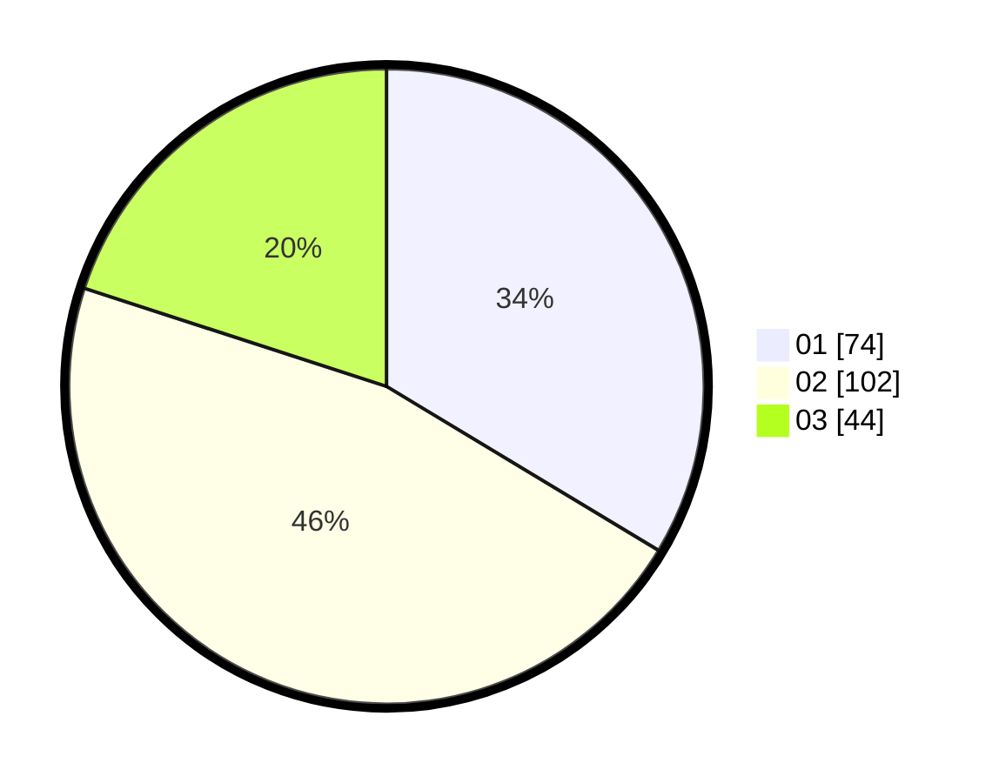

# Hasil

Hasil perolehan suara paslon dapat dilihat pada file paslon-01.txt, paslon-02.txt, dan paslon-03.txt.

Jika tidak ada, artinya data tersebut belum ada pada SIREKAP.

## Perolehan Suara

 * Paslon 01: **74**.
 * Paslon 02: **102**.
 * Paslon 03: **44**.

## Foto C Plano

https://sirekap-obj-formc.kpu.go.id/57ba/pemilu/ppwp/31/72/02/10/02/3172021002061-20240217-210441--9171f703-97d9-408f-aad5-78909e85622c.jpg

https://sirekap-obj-formc.kpu.go.id/57ba/pemilu/ppwp/31/72/02/10/02/3172021002061-20240217-210656--c61f24d3-a869-423b-8688-02bfe28fbcc7.jpg

https://sirekap-obj-formc.kpu.go.id/57ba/pemilu/ppwp/31/72/02/10/02/3172021002061-20240217-210727--7d49e195-2a64-487b-99b0-a5e1312cb8a5.jpg

## DATA PEMILIH TETAP

Jumlah pemilih dalam DPT: **289**.
 * L: **148**.
 * P: **141**.

## DATA PENGGUNA HAK PILIH

Jumlah pengguna hak pilih dalam DPT: **222**.
 * L: **108**.
 * P: **114**.

Jumlah pengguna hak pilih dalam DPTb: **0**.
 * L: **0**.
 * P: **0**.

Jumlah pengguna hak pilih dalam DPK: **1**.
 * L: **0**.
 * P: **1**.

Jumlah pengguna hak pilih: **223**.
 * L: **108**.
 * P: **115**.

## JUMLAH SUARA SAH DAN TIDAK SAH

JUMLAH SELURUH SUARA SAH: **220**.

JUMLAH SUARA TIDAK SAH: **3**.

JUMLAH SELURUH SUARA SAH DAN SUARA TIDAK SAH: **223**.
