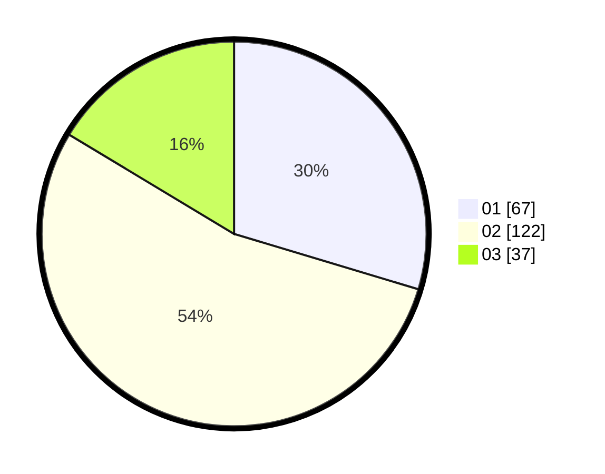

# Hasil

Hasil perolehan suara paslon dapat dilihat pada file paslon-01.txt, paslon-02.txt, dan paslon-03.txt.

Jika tidak ada, artinya data tersebut belum ada pada SIREKAP.

## Perolehan Suara

 * Paslon 01: **67**.
 * Paslon 02: **122**.
 * Paslon 03: **37**.

## Foto C Plano

https://sirekap-obj-formc.kpu.go.id/abf1/pemilu/ppwp/31/72/02/10/02/3172021002062-20240217-210940--78d47b56-1098-4c2c-ba5d-34ae7ec7ee3d.jpg

https://sirekap-obj-formc.kpu.go.id/abf1/pemilu/ppwp/31/72/02/10/02/3172021002062-20240217-211030--8dc4d8b8-10d7-4e94-b6db-2423dff59eab.jpg

https://sirekap-obj-formc.kpu.go.id/abf1/pemilu/ppwp/31/72/02/10/02/3172021002062-20240217-211050--66b5d461-73a8-48bc-b106-654c05c7e7ce.jpg

## DATA PEMILIH TETAP

Jumlah pemilih dalam DPT: **289**.
 * L: **134**.
 * P: **152**.

## DATA PENGGUNA HAK PILIH

Jumlah pengguna hak pilih dalam DPT: **215**.
 * L: **117**.
 * P: **98**.

Jumlah pengguna hak pilih dalam DPTb: **0**.
 * L: **0**.
 * P: **0**.

Jumlah pengguna hak pilih dalam DPK: **14**.
 * L: **6**.
 * P: **8**.

Jumlah pengguna hak pilih: **229**.
 * L: **123**.
 * P: **106**.

## JUMLAH SUARA SAH DAN TIDAK SAH

JUMLAH SELURUH SUARA SAH: **226**.

JUMLAH SUARA TIDAK SAH: **3**.

JUMLAH SELURUH SUARA SAH DAN SUARA TIDAK SAH: **229**.
