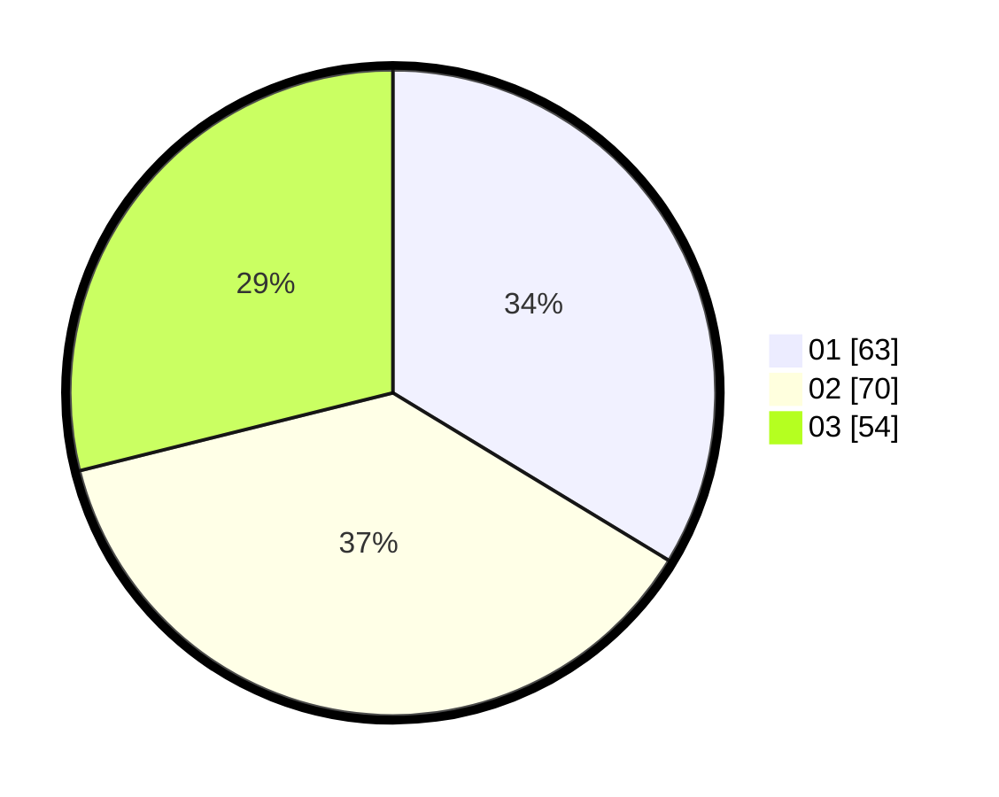

# Hasil

Hasil perolehan suara paslon dapat dilihat pada file paslon-01.txt, paslon-02.txt, dan paslon-03.txt.

Jika tidak ada, artinya data tersebut belum ada pada SIREKAP.

## Perolehan Suara

 * Paslon 01: **63**.
 * Paslon 02: **70**.
 * Paslon 03: **54**.

## Foto C Plano

https://sirekap-obj-formc.kpu.go.id/c027/pemilu/ppwp/31/72/02/10/02/3172021002070-20240219-141622--60205f3f-3621-41ee-b462-9a496a6df4eb.jpg

https://sirekap-obj-formc.kpu.go.id/c027/pemilu/ppwp/31/72/02/10/02/3172021002070-20240216-174726--7b1d92ef-8be3-440a-a1b0-d83b9c9f627b.jpg

https://sirekap-obj-formc.kpu.go.id/c027/pemilu/ppwp/31/72/02/10/02/3172021002070-20240216-173124--df39bd82-f3d9-41c1-b0cc-84c0bea1b371.jpg

## DATA PEMILIH TETAP

Jumlah pemilih dalam DPT: **224**.
 * L: **105**.
 * P: **119**.

## DATA PENGGUNA HAK PILIH

Jumlah pengguna hak pilih dalam DPT: **174**.
 * L: **78**.
 * P: **96**.

Jumlah pengguna hak pilih dalam DPTb: **9**.
 * L: **3**.
 * P: **6**.

Jumlah pengguna hak pilih dalam DPK: **4**.
 * L: **4**.
 * P: **0**.

Jumlah pengguna hak pilih: **187**.
 * L: **85**.
 * P: **102**.

## JUMLAH SUARA SAH DAN TIDAK SAH

JUMLAH SELURUH SUARA SAH: **187**.

JUMLAH SUARA TIDAK SAH: **0**.

JUMLAH SELURUH SUARA SAH DAN SUARA TIDAK SAH: **187**.
