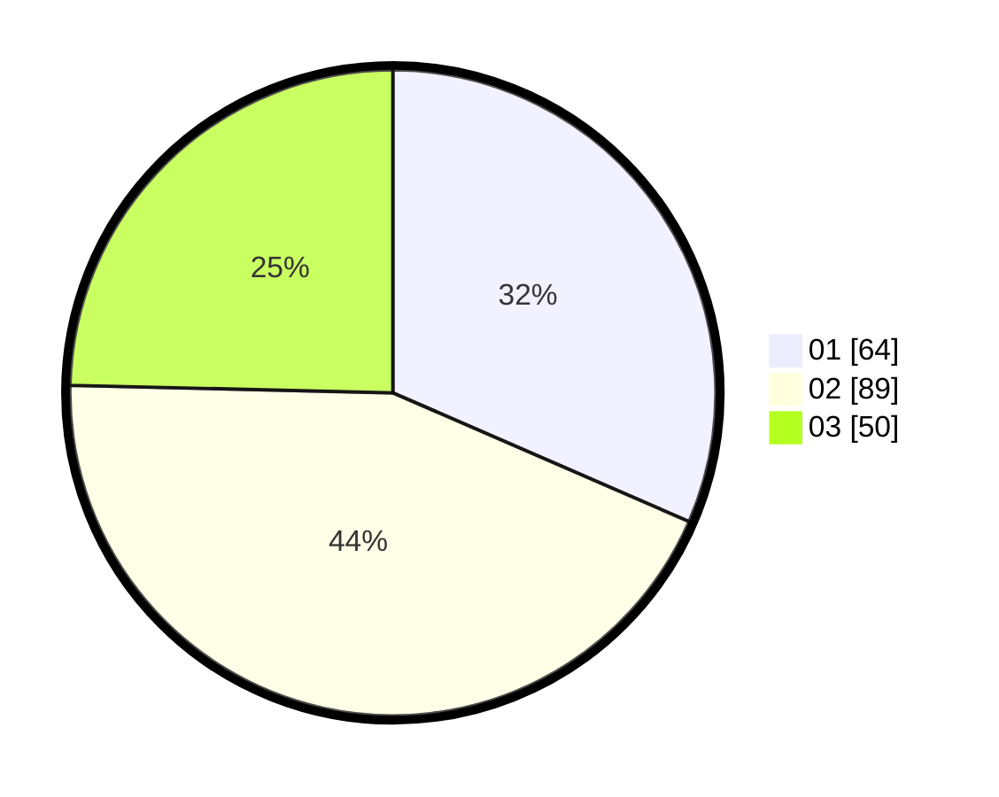

# Hasil

Hasil perolehan suara paslon dapat dilihat pada file paslon-01.txt, paslon-02.txt, dan paslon-03.txt.

Jika tidak ada, artinya data tersebut belum ada pada SIREKAP.

## Perolehan Suara

 * Paslon 01: **64**.
 * Paslon 02: **89**.
 * Paslon 03: **50**.

## Foto C Plano

https://sirekap-obj-formc.kpu.go.id/4ea2/pemilu/ppwp/31/72/02/10/02/3172021002074-20240214-203512--eaf15cff-fd3d-4ac7-b148-114c74fe5772.jpg

https://sirekap-obj-formc.kpu.go.id/4ea2/pemilu/ppwp/31/72/02/10/02/3172021002074-20240214-203529--0ce7fa07-3856-4321-95d9-713fb715f8d8.jpg

https://sirekap-obj-formc.kpu.go.id/4ea2/pemilu/ppwp/31/72/02/10/02/3172021002074-20240214-213419--39fb63ea-42e1-4779-a196-fdc2cf558d00.jpg
