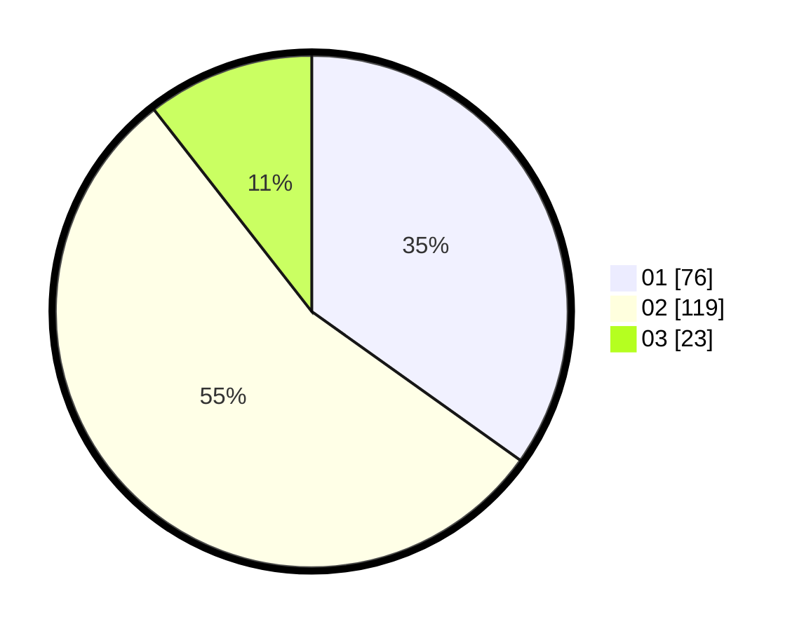

# Hasil

Hasil perolehan suara paslon dapat dilihat pada file paslon-01.txt, paslon-02.txt, dan paslon-03.txt.

Jika tidak ada, artinya data tersebut belum ada pada SIREKAP.

## Perolehan Suara

 * Paslon 01: **76**.
 * Paslon 02: **119**.
 * Paslon 03: **23**.

## Foto C Plano

https://sirekap-obj-formc.kpu.go.id/1c6b/pemilu/ppwp/31/72/02/10/02/3172021002083-20240216-130342--1719ac2d-64a7-4d7b-a8a4-e5cc225706df.jpg

https://sirekap-obj-formc.kpu.go.id/1c6b/pemilu/ppwp/31/72/02/10/02/3172021002083-20240217-110752--f0851e73-55d1-4a45-b0a3-0106e3a471b5.jpg

https://sirekap-obj-formc.kpu.go.id/1c6b/pemilu/ppwp/31/72/02/10/02/3172021002083-20240217-103836--71897c99-e0fc-4afb-9533-6ec34d0864aa.jpg
