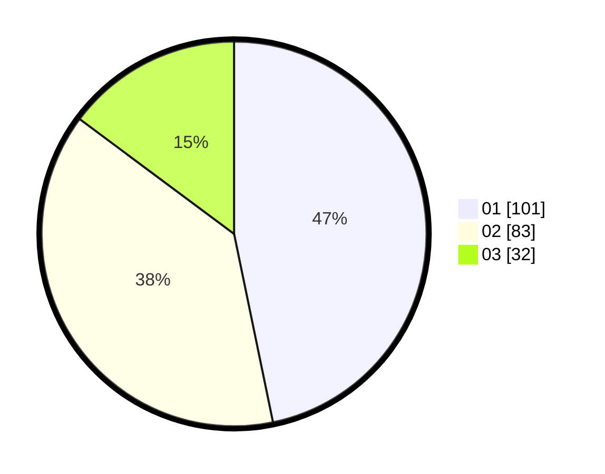

# Hasil

Hasil perolehan suara paslon dapat dilihat pada file paslon-01.txt, paslon-02.txt, dan paslon-03.txt.

Jika tidak ada, artinya data tersebut belum ada pada SIREKAP.

## Perolehan Suara

 * Paslon 01: **101**.
 * Paslon 02: **83**.
 * Paslon 03: **32**.

## Foto C Plano

https://sirekap-obj-formc.kpu.go.id/8760/pemilu/ppwp/31/72/02/10/02/3172021002088-20240216-202156--08381068-e51b-40ad-bb7b-981c61ede8c7.jpg

https://sirekap-obj-formc.kpu.go.id/8760/pemilu/ppwp/31/72/02/10/02/3172021002088-20240216-202233--177159b9-e66b-4fca-ac7f-f50244567e8e.jpg

https://sirekap-obj-formc.kpu.go.id/8760/pemilu/ppwp/31/72/02/10/02/3172021002088-20240216-202311--930caa71-3c79-4c6f-a61b-4c43c35badfb.jpg

## DATA PEMILIH TETAP

Jumlah pemilih dalam DPT: **286**.
 * L: **144**.
 * P: **142**.

## DATA PENGGUNA HAK PILIH

Jumlah pengguna hak pilih dalam DPT: **211**.
 * L: **110**.
 * P: **101**.

Jumlah pengguna hak pilih dalam DPTb: **3**.
 * L: **1**.
 * P: **2**.

Jumlah pengguna hak pilih dalam DPK: **2**.
 * L: **1**.
 * P: **1**.

Jumlah pengguna hak pilih: **216**.
 * L: **112**.
 * P: **104**.

## JUMLAH SUARA SAH DAN TIDAK SAH

JUMLAH SELURUH SUARA SAH: **216**.

JUMLAH SUARA TIDAK SAH: **9**.

JUMLAH SELURUH SUARA SAH DAN SUARA TIDAK SAH: **225**.
