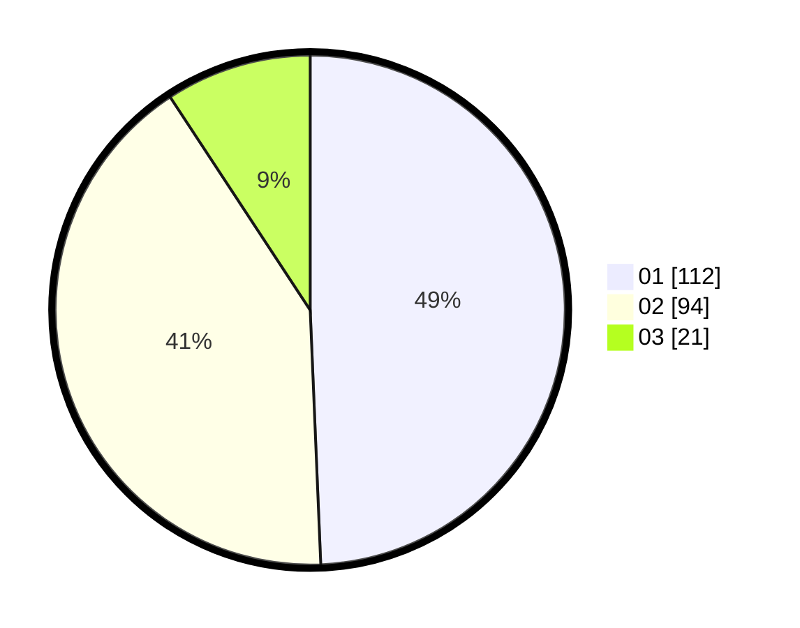

# Hasil

Hasil perolehan suara paslon dapat dilihat pada file paslon-01.txt, paslon-02.txt, dan paslon-03.txt.

Jika tidak ada, artinya data tersebut belum ada pada SIREKAP.

## Perolehan Suara

 * Paslon 01: **112**.
 * Paslon 02: **94**.
 * Paslon 03: **21**.

## Foto C Plano

https://sirekap-obj-formc.kpu.go.id/566c/pemilu/ppwp/31/72/02/10/02/3172021002135-20240214-204008--0b7aa992-d9d5-497c-9127-9edc18af3aa9.jpg

https://sirekap-obj-formc.kpu.go.id/566c/pemilu/ppwp/31/72/02/10/02/3172021002135-20240214-220035--7cad8eb0-b698-4f6f-a83f-701074d6cd47.jpg

https://sirekap-obj-formc.kpu.go.id/566c/pemilu/ppwp/31/72/02/10/02/3172021002135-20240214-200552--6fa60aa3-0263-4ddb-b7c5-000a7fa0bbd1.jpg
