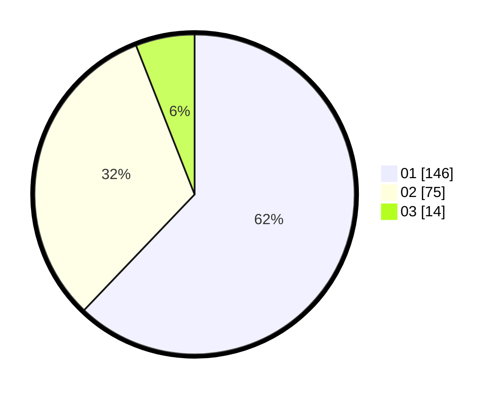

# Hasil

Hasil perolehan suara paslon dapat dilihat pada file paslon-01.txt, paslon-02.txt, dan paslon-03.txt.

Jika tidak ada, artinya data tersebut belum ada pada SIREKAP.

## Perolehan Suara

 * Paslon 01: **146**.
 * Paslon 02: **75**.
 * Paslon 03: **14**.

## Foto C Plano

https://sirekap-obj-formc.kpu.go.id/e905/pemilu/ppwp/31/72/02/10/02/3172021002159-20240214-155449--bae5c17e-6263-41d0-8f67-ecd536ebd116.jpg

https://sirekap-obj-formc.kpu.go.id/e905/pemilu/ppwp/31/72/02/10/02/3172021002159-20240214-155456--2a5bf2df-6fcd-4608-ab01-689caa529ec0.jpg

https://sirekap-obj-formc.kpu.go.id/e905/pemilu/ppwp/31/72/02/10/02/3172021002159-20240214-155505--d2f54923-79ef-49d2-894b-50699e6323c3.jpg
