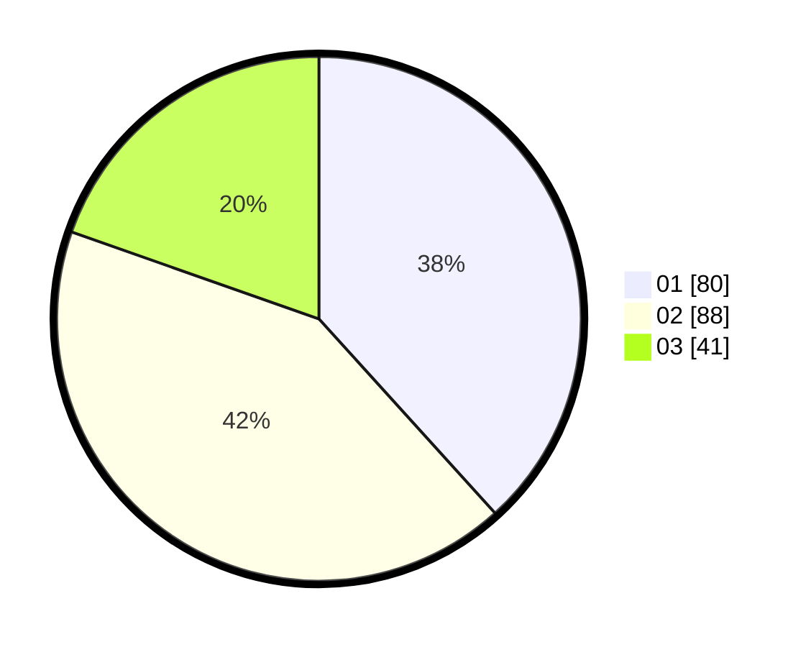

# Hasil

Hasil perolehan suara paslon dapat dilihat pada file paslon-01.txt, paslon-02.txt, dan paslon-03.txt.

Jika tidak ada, artinya data tersebut belum ada pada SIREKAP.

## Perolehan Suara

 * Paslon 01: **80**.
 * Paslon 02: **88**.
 * Paslon 03: **41**.

## Foto C Plano

https://sirekap-obj-formc.kpu.go.id/44d1/pemilu/ppwp/31/72/02/10/02/3172021002180-20240214-202023--ffeba2d8-f5e1-425a-b531-fe067d066cb5.jpg

https://sirekap-obj-formc.kpu.go.id/44d1/pemilu/ppwp/31/72/02/10/02/3172021002180-20240214-202130--c8356d45-8b95-4b64-9237-3521555ac5a4.jpg

https://sirekap-obj-formc.kpu.go.id/44d1/pemilu/ppwp/31/72/02/10/02/3172021002180-20240214-202212--4ed80d37-e7ff-4f3b-83a7-713990b84dbc.jpg

## DATA PEMILIH TETAP

Jumlah pemilih dalam DPT: **285**.
 * L: **152**.
 * P: **133**.

## DATA PENGGUNA HAK PILIH

Jumlah pengguna hak pilih dalam DPT: **191**.
 * L: **101**.
 * P: **90**.

Jumlah pengguna hak pilih dalam DPTb: **19**.
 * L: **8**.
 * P: **11**.

Jumlah pengguna hak pilih dalam DPK: **2**.
 * L: **1**.
 * P: **1**.

Jumlah pengguna hak pilih: **212**.
 * L: **110**.
 * P: **102**.

## JUMLAH SUARA SAH DAN TIDAK SAH

JUMLAH SELURUH SUARA SAH: **209**.

JUMLAH SUARA TIDAK SAH: **3**.

JUMLAH SELURUH SUARA SAH DAN SUARA TIDAK SAH: **212**.
