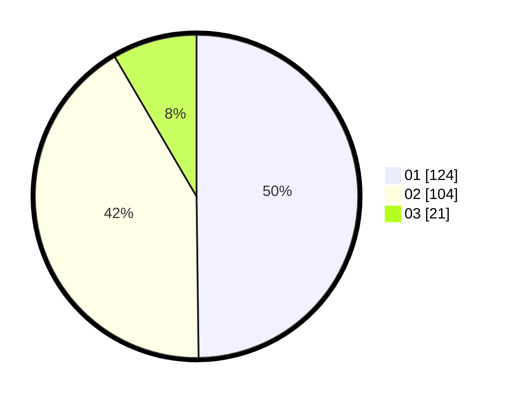

# Hasil

Hasil perolehan suara paslon dapat dilihat pada file paslon-01.txt, paslon-02.txt, dan paslon-03.txt.

Jika tidak ada, artinya data tersebut belum ada pada SIREKAP.

## Perolehan Suara

 * Paslon 01: **124**.
 * Paslon 02: **104**.
 * Paslon 03: **21**.

## Foto C Plano

https://sirekap-obj-formc.kpu.go.id/ce61/pemilu/ppwp/31/72/02/10/02/3172021002185-20240214-193612--8c9df0b2-536d-4464-a1ce-8424add3d8a0.jpg

https://sirekap-obj-formc.kpu.go.id/ce61/pemilu/ppwp/31/72/02/10/02/3172021002185-20240214-193625--2581dc8e-2bc5-433e-84a4-cde2c374f465.jpg
