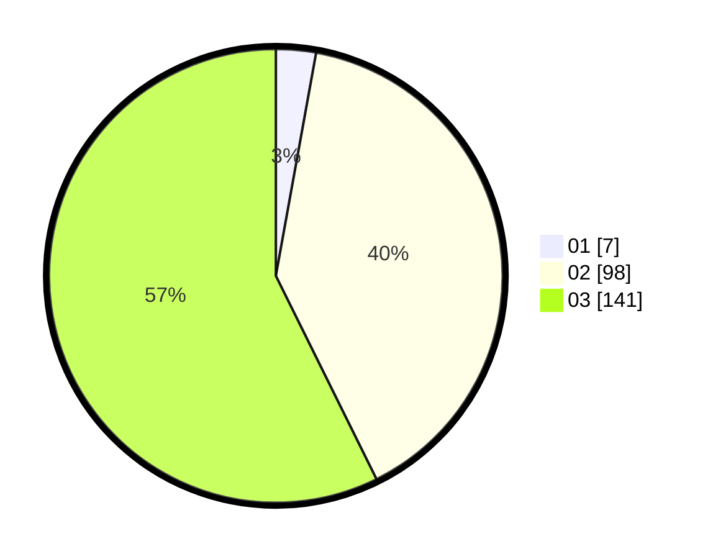

# Hasil

Hasil perolehan suara paslon dapat dilihat pada file paslon-01.txt, paslon-02.txt, dan paslon-03.txt.

Jika tidak ada, artinya data tersebut belum ada pada SIREKAP.

## Perolehan Suara

 * Paslon 01: **7**.
 * Paslon 02: **98**.
 * Paslon 03: **141**.

## Foto C Plano

https://sirekap-obj-formc.kpu.go.id/9fcc/pemilu/ppwp/31/72/02/10/02/3172021002198-20240214-201950--6a06583a-3356-4f96-8fbb-8f2dfd0f94e0.jpg

https://sirekap-obj-formc.kpu.go.id/9fcc/pemilu/ppwp/31/72/02/10/02/3172021002198-20240214-202349--1753f098-c50f-49ae-bd6b-9221444eb01a.jpg

https://sirekap-obj-formc.kpu.go.id/9fcc/pemilu/ppwp/31/72/02/10/02/3172021002198-20240214-202543--395ea103-6cdc-4464-af05-9e4a0c262d16.jpg
