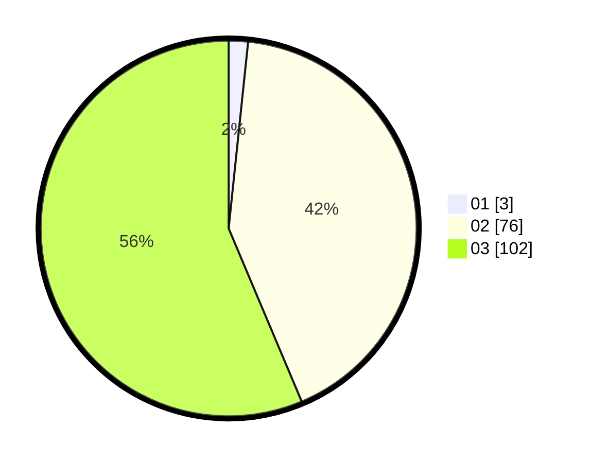

# Hasil

Hasil perolehan suara paslon dapat dilihat pada file paslon-01.txt, paslon-02.txt, dan paslon-03.txt.

Jika tidak ada, artinya data tersebut belum ada pada SIREKAP.

## Perolehan Suara

 * Paslon 01: **3**.
 * Paslon 02: **76**.
 * Paslon 03: **102**.

## Foto C Plano

https://sirekap-obj-formc.kpu.go.id/d402/pemilu/ppwp/31/72/02/10/02/3172021002204-20240215-215901--f7083941-103f-4d09-8ba0-5c2313c9fe78.jpg

https://sirekap-obj-formc.kpu.go.id/d402/pemilu/ppwp/31/72/02/10/02/3172021002204-20240214-184834--bd4122da-4f30-4dec-9ec4-f4b26e494695.jpg

https://sirekap-obj-formc.kpu.go.id/d402/pemilu/ppwp/31/72/02/10/02/3172021002204-20240215-215902--e68b2b16-789f-4ded-8eb4-b8dbf613d1bb.jpg

## DATA PEMILIH TETAP

Jumlah pemilih dalam DPT: **273**.
 * L: **130**.
 * P: **143**.

## DATA PENGGUNA HAK PILIH

Jumlah pengguna hak pilih dalam DPT: **179**.
 * L: **85**.
 * P: **94**.

Jumlah pengguna hak pilih dalam DPTb: **0**.
 * L: **0**.
 * P: **0**.

Jumlah pengguna hak pilih dalam DPK: **2**.
 * L: **1**.
 * P: **1**.

Jumlah pengguna hak pilih: **181**.
 * L: **86**.
 * P: **95**.

## JUMLAH SUARA SAH DAN TIDAK SAH

JUMLAH SELURUH SUARA SAH: **181**.

JUMLAH SUARA TIDAK SAH: **0**.

JUMLAH SELURUH SUARA SAH DAN SUARA TIDAK SAH: **181**.
