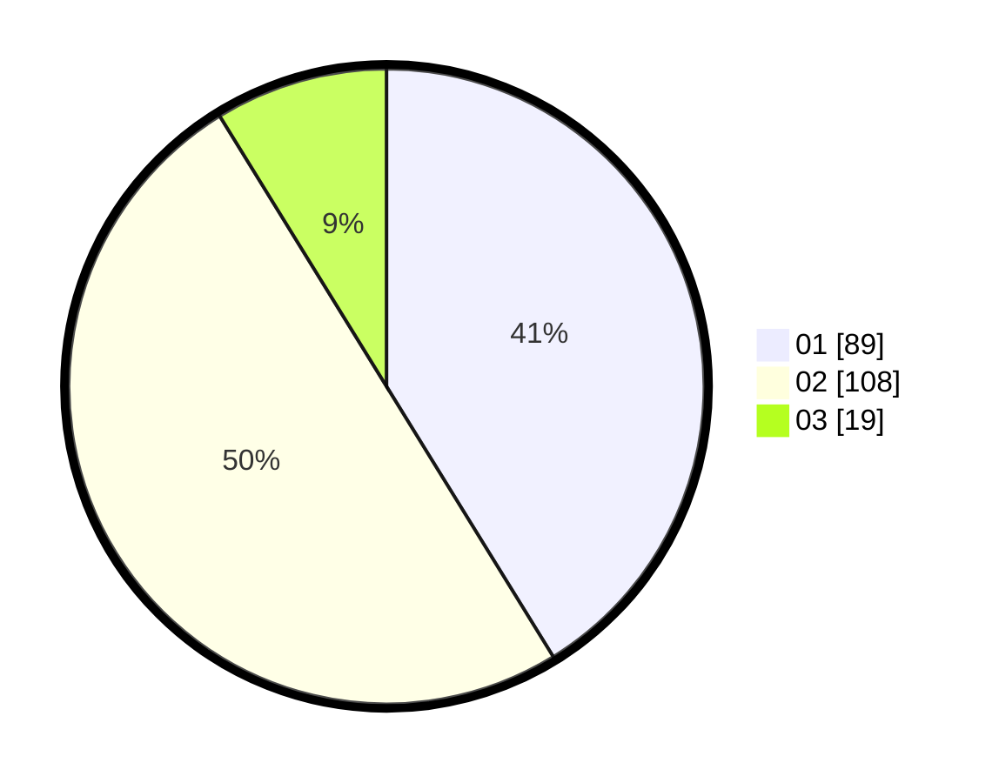

# Hasil

Hasil perolehan suara paslon dapat dilihat pada file paslon-01.txt, paslon-02.txt, dan paslon-03.txt.

Jika tidak ada, artinya data tersebut belum ada pada SIREKAP.

## Perolehan Suara

 * Paslon 01: **89**.
 * Paslon 02: **108**.
 * Paslon 03: **19**.

## Foto C Plano

https://sirekap-obj-formc.kpu.go.id/b249/pemilu/ppwp/31/72/02/10/03/3172021003006-20240214-184310--b32960ed-699d-4994-93c7-bd390cd4e970.jpg

https://sirekap-obj-formc.kpu.go.id/b249/pemilu/ppwp/31/72/02/10/03/3172021003006-20240214-185137--ad46d94e-6624-42d9-a648-77c3bf4fbf31.jpg

https://sirekap-obj-formc.kpu.go.id/b249/pemilu/ppwp/31/72/02/10/03/3172021003006-20240214-184446--f97323bf-ee46-4240-8acd-c4a1ad5f8bdc.jpg

## DATA PEMILIH TETAP

Jumlah pemilih dalam DPT: **286**.
 * L: **138**.
 * P: **148**.

## DATA PENGGUNA HAK PILIH

Jumlah pengguna hak pilih dalam DPT: **221**.
 * L: **99**.
 * P: **122**.

Jumlah pengguna hak pilih dalam DPTb: **0**.
 * L: **0**.
 * P: **0**.

Jumlah pengguna hak pilih dalam DPK: **0**.
 * L: **0**.
 * P: **0**.

Jumlah pengguna hak pilih: **221**.
 * L: **99**.
 * P: **122**.

## JUMLAH SUARA SAH DAN TIDAK SAH

JUMLAH SELURUH SUARA SAH: **216**.

JUMLAH SUARA TIDAK SAH: **5**.

JUMLAH SELURUH SUARA SAH DAN SUARA TIDAK SAH: **221**.
