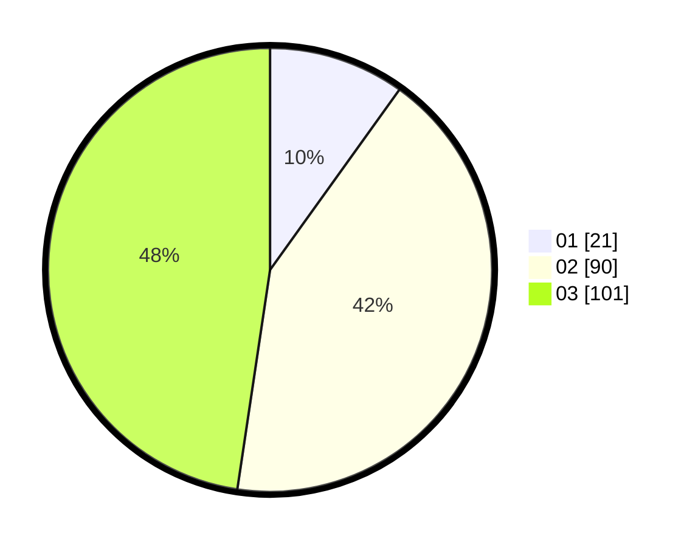

# Hasil

Hasil perolehan suara paslon dapat dilihat pada file paslon-01.txt, paslon-02.txt, dan paslon-03.txt.

Jika tidak ada, artinya data tersebut belum ada pada SIREKAP.

## Perolehan Suara

 * Paslon 01: **21**.
 * Paslon 02: **90**.
 * Paslon 03: **101**.

## Foto C Plano

https://sirekap-obj-formc.kpu.go.id/6781/pemilu/ppwp/31/72/02/10/03/3172021003011-20240214-213546--92ad7c92-68fe-41d7-9fae-866ae64a5c46.jpg

https://sirekap-obj-formc.kpu.go.id/6781/pemilu/ppwp/31/72/02/10/03/3172021003011-20240214-205504--3ebd14a9-d203-40b2-bf21-3bac098e91c9.jpg

https://sirekap-obj-formc.kpu.go.id/6781/pemilu/ppwp/31/72/02/10/03/3172021003011-20240214-220911--875296a9-1d3f-4b95-ab04-32e0a001872e.jpg
