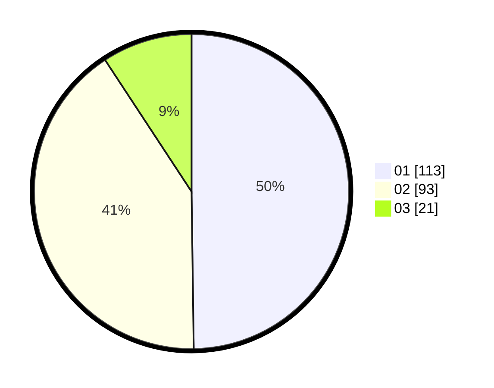

# Hasil

Hasil perolehan suara paslon dapat dilihat pada file paslon-01.txt, paslon-02.txt, dan paslon-03.txt.

Jika tidak ada, artinya data tersebut belum ada pada SIREKAP.

## Perolehan Suara

 * Paslon 01: **113**.
 * Paslon 02: **93**.
 * Paslon 03: **21**.

## Foto C Plano

https://sirekap-obj-formc.kpu.go.id/0797/pemilu/ppwp/31/72/02/10/03/3172021003025-20240214-155313--369608aa-b59a-4685-8b0e-c2c013f1a810.jpg

https://sirekap-obj-formc.kpu.go.id/0797/pemilu/ppwp/31/72/02/10/03/3172021003025-20240214-160059--80e8fed1-dc21-4d06-8ab4-44cd6b3b5f80.jpg
