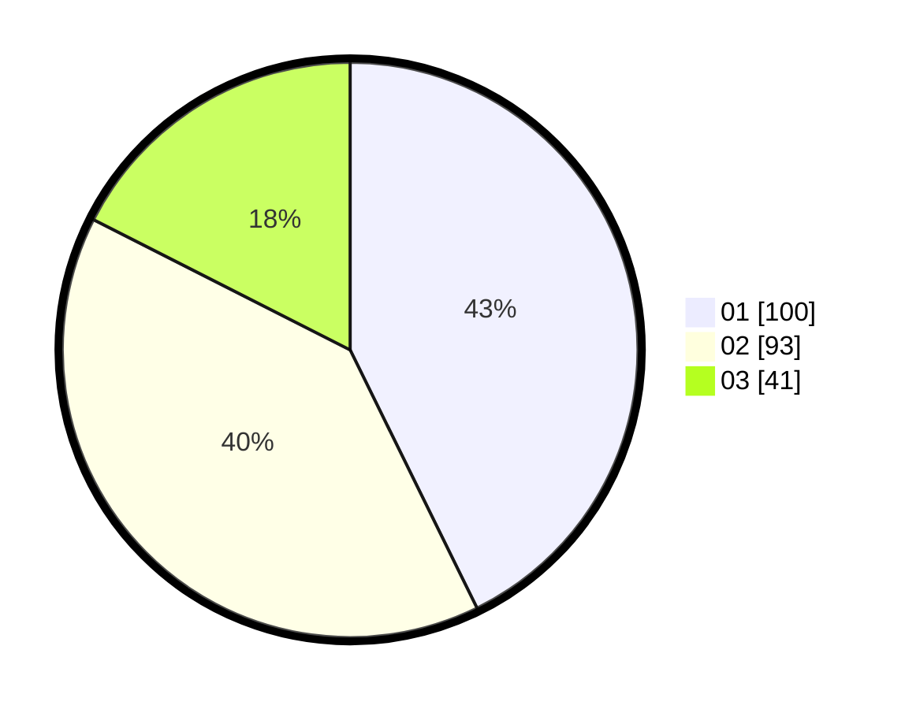

# Hasil

Hasil perolehan suara paslon dapat dilihat pada file paslon-01.txt, paslon-02.txt, dan paslon-03.txt.

Jika tidak ada, artinya data tersebut belum ada pada SIREKAP.

## Perolehan Suara

 * Paslon 01: **100**.
 * Paslon 02: **93**.
 * Paslon 03: **41**.

## Foto C Plano

https://sirekap-obj-formc.kpu.go.id/6a8d/pemilu/ppwp/31/72/02/10/03/3172021003027-20240214-162224--a54c6e36-ae23-4670-9e91-192bdc61dd9a.jpg

https://sirekap-obj-formc.kpu.go.id/6a8d/pemilu/ppwp/31/72/02/10/03/3172021003027-20240214-184543--9ae9af47-06d2-4137-a556-c2fc5cbe350a.jpg

https://sirekap-obj-formc.kpu.go.id/6a8d/pemilu/ppwp/31/72/02/10/03/3172021003027-20240214-184515--d03cbce4-9acf-46d4-bb6c-bdf45b914200.jpg

## DATA PEMILIH TETAP

Jumlah pemilih dalam DPT: **298**.
 * L: **161**.
 * P: **137**.

## DATA PENGGUNA HAK PILIH

Jumlah pengguna hak pilih dalam DPT: **245**.
 * L: **131**.
 * P: **114**.

Jumlah pengguna hak pilih dalam DPTb: **0**.
 * L: **0**.
 * P: **0**.

Jumlah pengguna hak pilih dalam DPK: **1**.
 * L: **1**.
 * P: **0**.

Jumlah pengguna hak pilih: **246**.
 * L: **132**.
 * P: **114**.

## JUMLAH SUARA SAH DAN TIDAK SAH

JUMLAH SELURUH SUARA SAH: **234**.

JUMLAH SUARA TIDAK SAH: **12**.

JUMLAH SELURUH SUARA SAH DAN SUARA TIDAK SAH: **246**.
