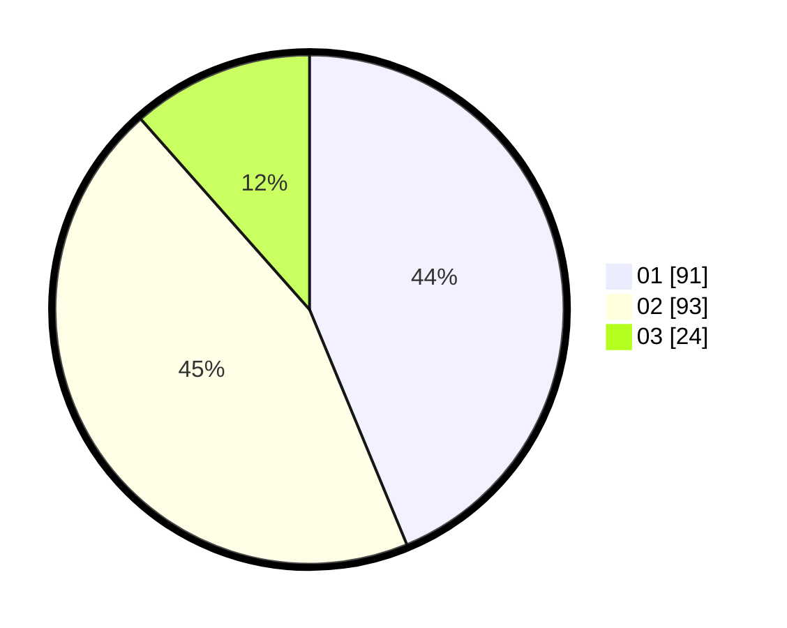

# Hasil

Hasil perolehan suara paslon dapat dilihat pada file paslon-01.txt, paslon-02.txt, dan paslon-03.txt.

Jika tidak ada, artinya data tersebut belum ada pada SIREKAP.

## Perolehan Suara

 * Paslon 01: **91**.
 * Paslon 02: **93**.
 * Paslon 03: **24**.

## Foto C Plano

https://sirekap-obj-formc.kpu.go.id/cc25/pemilu/ppwp/31/72/02/10/03/3172021003042-20240214-184750--c6c9615b-830f-4772-92b8-96b7da29a26a.jpg

https://sirekap-obj-formc.kpu.go.id/cc25/pemilu/ppwp/31/72/02/10/03/3172021003042-20240214-184743--e3a0d601-4ec5-43f5-9b3d-45b009860628.jpg

https://sirekap-obj-formc.kpu.go.id/cc25/pemilu/ppwp/31/72/02/10/03/3172021003042-20240214-184728--b2a3bee8-02a1-4fac-986c-b7d897db1df9.jpg

## DATA PEMILIH TETAP

Jumlah pemilih dalam DPT: **289**.
 * L: **129**.
 * P: **160**.

## DATA PENGGUNA HAK PILIH

Jumlah pengguna hak pilih dalam DPT: **202**.
 * L: **87**.
 * P: **115**.

Jumlah pengguna hak pilih dalam DPTb: **1**.
 * L: **1**.
 * P: **0**.

Jumlah pengguna hak pilih dalam DPK: **6**.
 * L: **4**.
 * P: **2**.

Jumlah pengguna hak pilih: **209**.
 * L: **92**.
 * P: **117**.

## JUMLAH SUARA SAH DAN TIDAK SAH

JUMLAH SELURUH SUARA SAH: **208**.

JUMLAH SUARA TIDAK SAH: **1**.

JUMLAH SELURUH SUARA SAH DAN SUARA TIDAK SAH: **209**.
