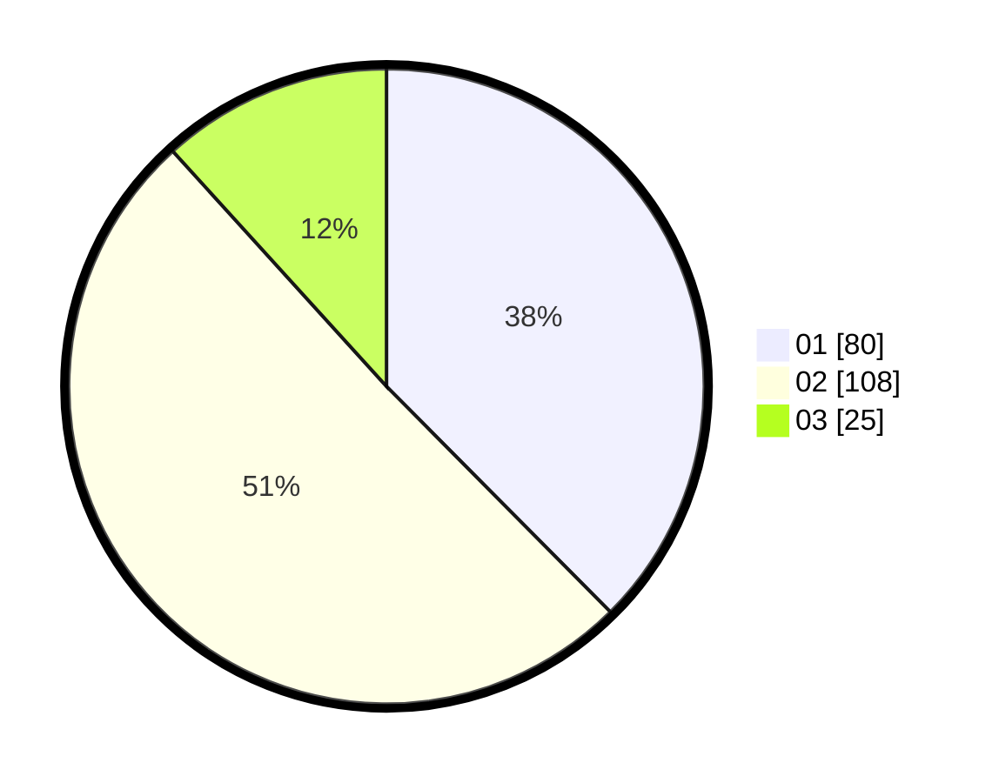

# Hasil

Hasil perolehan suara paslon dapat dilihat pada file paslon-01.txt, paslon-02.txt, dan paslon-03.txt.

Jika tidak ada, artinya data tersebut belum ada pada SIREKAP.

## Perolehan Suara

 * Paslon 01: **80**.
 * Paslon 02: **108**.
 * Paslon 03: **25**.

## Foto C Plano

https://sirekap-obj-formc.kpu.go.id/6301/pemilu/ppwp/31/72/02/10/03/3172021003057-20240214-232639--892836a5-098b-4f38-92ae-29e521867d38.jpg

https://sirekap-obj-formc.kpu.go.id/6301/pemilu/ppwp/31/72/02/10/03/3172021003057-20240216-175453--3c4b03c8-f1d7-426c-afb3-b44713f3486a.jpg

https://sirekap-obj-formc.kpu.go.id/6301/pemilu/ppwp/31/72/02/10/03/3172021003057-20240216-175613--df113499-8e60-4e9a-8816-9938f2aca1d2.jpg

## DATA PEMILIH TETAP

Jumlah pemilih dalam DPT: **290**.
 * L: **151**.
 * P: **139**.

## DATA PENGGUNA HAK PILIH

Jumlah pengguna hak pilih dalam DPT: **218**.
 * L: **104**.
 * P: **114**.

Jumlah pengguna hak pilih dalam DPTb: **0**.
 * L: **0**.
 * P: **0**.

Jumlah pengguna hak pilih dalam DPK: **1**.
 * L: **0**.
 * P: **1**.

Jumlah pengguna hak pilih: **219**.
 * L: **104**.
 * P: **115**.

## JUMLAH SUARA SAH DAN TIDAK SAH

JUMLAH SELURUH SUARA SAH: **214**.

JUMLAH SUARA TIDAK SAH: **5**.

JUMLAH SELURUH SUARA SAH DAN SUARA TIDAK SAH: **219**.
