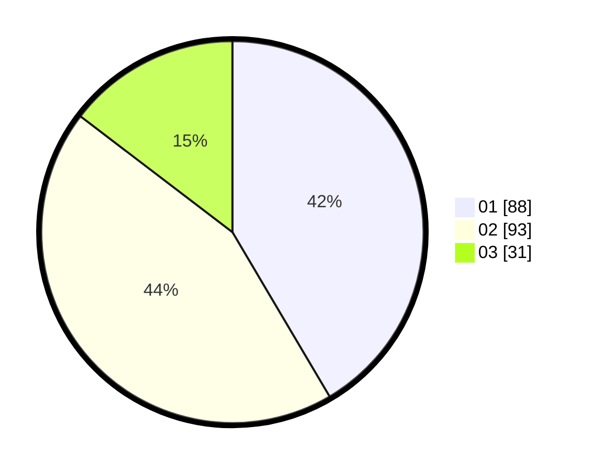

# Hasil

Hasil perolehan suara paslon dapat dilihat pada file paslon-01.txt, paslon-02.txt, dan paslon-03.txt.

Jika tidak ada, artinya data tersebut belum ada pada SIREKAP.

## Perolehan Suara

 * Paslon 01: **88**.
 * Paslon 02: **93**.
 * Paslon 03: **31**.

## Foto C Plano

https://sirekap-obj-formc.kpu.go.id/756b/pemilu/ppwp/31/72/02/10/03/3172021003059-20240215-192617--df90197b-b88d-4aab-85ea-f410ae94bac3.jpg

https://sirekap-obj-formc.kpu.go.id/756b/pemilu/ppwp/31/72/02/10/03/3172021003059-20240214-205653--278ac2df-cb0f-4ef7-9f27-c64941c1521b.jpg
