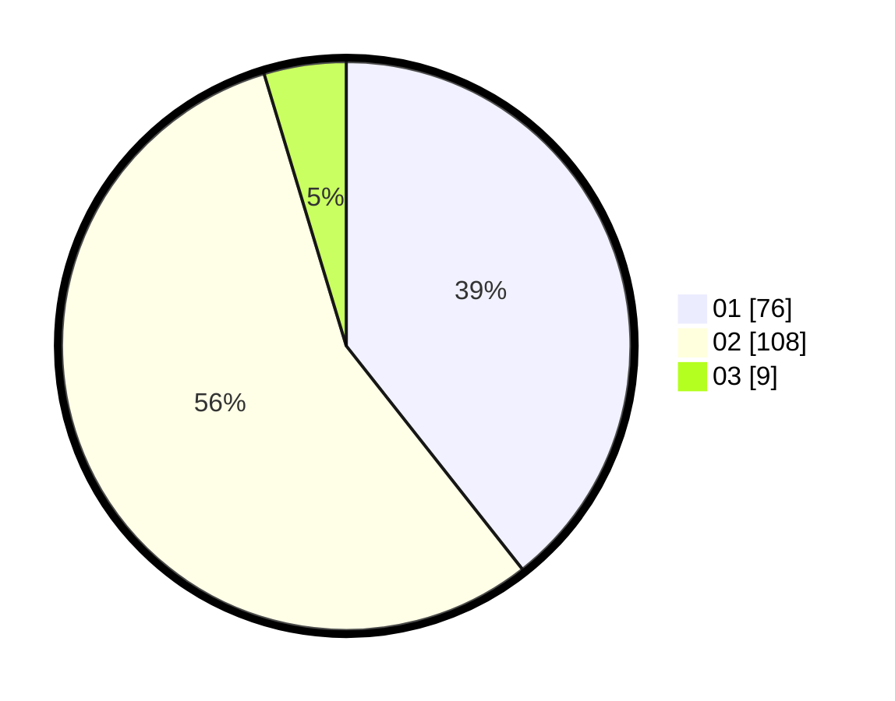

# Hasil

Hasil perolehan suara paslon dapat dilihat pada file paslon-01.txt, paslon-02.txt, dan paslon-03.txt.

Jika tidak ada, artinya data tersebut belum ada pada SIREKAP.

## Perolehan Suara

 * Paslon 01: **76**.
 * Paslon 02: **108**.
 * Paslon 03: **9**.

## Foto C Plano

https://sirekap-obj-formc.kpu.go.id/4fb0/pemilu/ppwp/31/72/02/10/03/3172021003078-20240214-155128--4195be86-bee5-465a-bafe-e326f0d88d81.jpg

https://sirekap-obj-formc.kpu.go.id/4fb0/pemilu/ppwp/31/72/02/10/03/3172021003078-20240214-155218--da7af876-2491-4522-83f2-dea9f34dceb4.jpg

https://sirekap-obj-formc.kpu.go.id/4fb0/pemilu/ppwp/31/72/02/10/03/3172021003078-20240214-155256--bacd9047-2a48-4166-aebc-bd0a3fbda13a.jpg

## DATA PEMILIH TETAP

Jumlah pemilih dalam DPT: **269**.
 * L: **136**.
 * P: **133**.

## DATA PENGGUNA HAK PILIH

Jumlah pengguna hak pilih dalam DPT: **182**.
 * L: **87**.
 * P: **95**.

Jumlah pengguna hak pilih dalam DPTb: **0**.
 * L: **0**.
 * P: **0**.

Jumlah pengguna hak pilih dalam DPK: **11**.
 * L: **4**.
 * P: **7**.

Jumlah pengguna hak pilih: **193**.
 * L: **91**.
 * P: **102**.

## JUMLAH SUARA SAH DAN TIDAK SAH

JUMLAH SELURUH SUARA SAH: **193**.

JUMLAH SUARA TIDAK SAH: **0**.

JUMLAH SELURUH SUARA SAH DAN SUARA TIDAK SAH: **193**.
