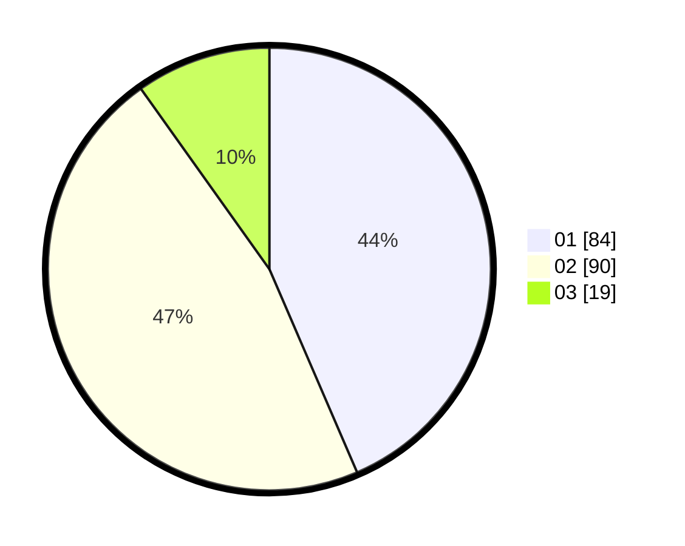

# Hasil

Hasil perolehan suara paslon dapat dilihat pada file paslon-01.txt, paslon-02.txt, dan paslon-03.txt.

Jika tidak ada, artinya data tersebut belum ada pada SIREKAP.

## Perolehan Suara

 * Paslon 01: **84**.
 * Paslon 02: **90**.
 * Paslon 03: **19**.

## Foto C Plano

https://sirekap-obj-formc.kpu.go.id/e5ff/pemilu/ppwp/31/72/02/10/03/3172021003079-20240215-000316--b86ab925-ae26-44ad-8925-65ceaad4c993.jpg

https://sirekap-obj-formc.kpu.go.id/e5ff/pemilu/ppwp/31/72/02/10/03/3172021003079-20240215-000847--921af43d-037b-4b04-b6b4-023843cf8a3d.jpg

https://sirekap-obj-formc.kpu.go.id/e5ff/pemilu/ppwp/31/72/02/10/03/3172021003079-20240215-000701--91457730-ffde-43cf-9818-c22423d05eef.jpg

## DATA PEMILIH TETAP

Jumlah pemilih dalam DPT: **254**.
 * L: **126**.
 * P: **128**.

## DATA PENGGUNA HAK PILIH

Jumlah pengguna hak pilih dalam DPT: **195**.
 * L: **96**.
 * P: **99**.

Jumlah pengguna hak pilih dalam DPTb: **1**.
 * L: **0**.
 * P: **1**.

Jumlah pengguna hak pilih dalam DPK: **2**.
 * L: **2**.
 * P: **0**.

Jumlah pengguna hak pilih: **198**.
 * L: **98**.
 * P: **100**.

## JUMLAH SUARA SAH DAN TIDAK SAH

JUMLAH SELURUH SUARA SAH: **193**.

JUMLAH SUARA TIDAK SAH: **5**.

JUMLAH SELURUH SUARA SAH DAN SUARA TIDAK SAH: **198**.
