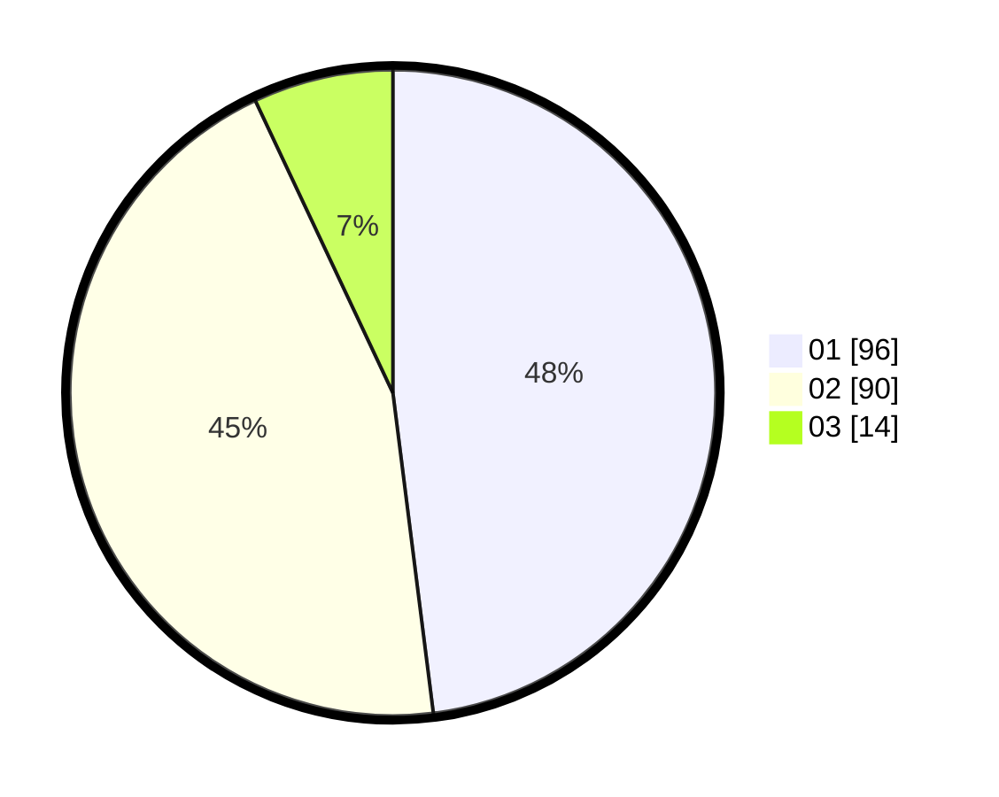

# Hasil

Hasil perolehan suara paslon dapat dilihat pada file paslon-01.txt, paslon-02.txt, dan paslon-03.txt.

Jika tidak ada, artinya data tersebut belum ada pada SIREKAP.

## Perolehan Suara

 * Paslon 01: **96**.
 * Paslon 02: **90**.
 * Paslon 03: **14**.

## Foto C Plano

https://sirekap-obj-formc.kpu.go.id/1f5e/pemilu/ppwp/31/72/02/10/03/3172021003086-20240214-220651--bc2635fc-5584-41d8-a2c7-7b9c3711621c.jpg

https://sirekap-obj-formc.kpu.go.id/1f5e/pemilu/ppwp/31/72/02/10/03/3172021003086-20240214-204325--b0b5b127-6084-40e9-b985-24fb1ace5d2a.jpg

https://sirekap-obj-formc.kpu.go.id/1f5e/pemilu/ppwp/31/72/02/10/03/3172021003086-20240214-204438--5f0a7ec7-c560-4804-b11c-77143cf894a2.jpg

## DATA PEMILIH TETAP

Jumlah pemilih dalam DPT: **255**.
 * L: **131**.
 * P: **124**.

## DATA PENGGUNA HAK PILIH

Jumlah pengguna hak pilih dalam DPT: **197**.
 * L: **94**.
 * P: **103**.

Jumlah pengguna hak pilih dalam DPTb: **2**.
 * L: **1**.
 * P: **1**.

Jumlah pengguna hak pilih dalam DPK: **4**.
 * L: **2**.
 * P: **2**.

Jumlah pengguna hak pilih: **203**.
 * L: **97**.
 * P: **106**.

## JUMLAH SUARA SAH DAN TIDAK SAH

JUMLAH SELURUH SUARA SAH: **200**.

JUMLAH SUARA TIDAK SAH: **3**.

JUMLAH SELURUH SUARA SAH DAN SUARA TIDAK SAH: **203**.
