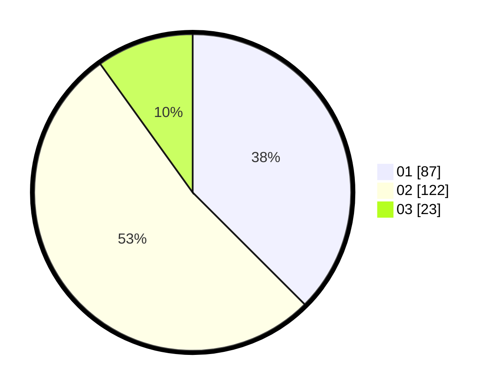

# Hasil

Hasil perolehan suara paslon dapat dilihat pada file paslon-01.txt, paslon-02.txt, dan paslon-03.txt.

Jika tidak ada, artinya data tersebut belum ada pada SIREKAP.

## Perolehan Suara

 * Paslon 01: **87**.
 * Paslon 02: **122**.
 * Paslon 03: **23**.

## Foto C Plano

https://sirekap-obj-formc.kpu.go.id/1902/pemilu/ppwp/31/72/02/10/03/3172021003087-20240217-164114--73831161-4c54-4a91-8c7c-fa0df7409d74.jpg

https://sirekap-obj-formc.kpu.go.id/1902/pemilu/ppwp/31/72/02/10/03/3172021003087-20240214-224059--43b8a388-ec2d-4010-9585-566079b88a93.jpg

https://sirekap-obj-formc.kpu.go.id/1902/pemilu/ppwp/31/72/02/10/03/3172021003087-20240214-224140--ca1f1e3e-7154-48ab-a9aa-10476e30b855.jpg
