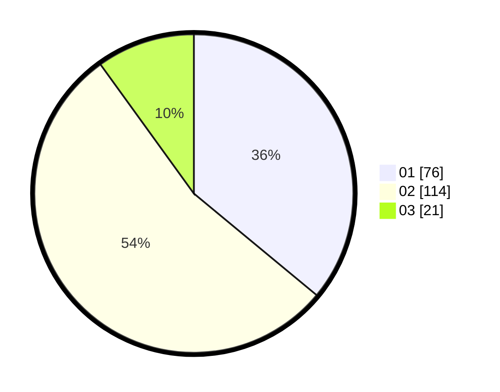

# Hasil

Hasil perolehan suara paslon dapat dilihat pada file paslon-01.txt, paslon-02.txt, dan paslon-03.txt.

Jika tidak ada, artinya data tersebut belum ada pada SIREKAP.

## Perolehan Suara

 * Paslon 01: **76**.
 * Paslon 02: **114**.
 * Paslon 03: **21**.

## Foto C Plano

https://sirekap-obj-formc.kpu.go.id/fe07/pemilu/ppwp/31/72/02/10/03/3172021003110-20240214-194205--cb5d7aa1-5435-4bc7-954c-6606ff693ffd.jpg

https://sirekap-obj-formc.kpu.go.id/fe07/pemilu/ppwp/31/72/02/10/03/3172021003110-20240216-041113--7e48229c-d71e-4b15-b506-bf9aae0151c7.jpg

https://sirekap-obj-formc.kpu.go.id/fe07/pemilu/ppwp/31/72/02/10/03/3172021003110-20240216-041113--dea36553-d85c-48fb-a71e-0c1c577840bf.jpg

## DATA PEMILIH TETAP

Jumlah pemilih dalam DPT: **268**.
 * L: **126**.
 * P: **142**.

## DATA PENGGUNA HAK PILIH

Jumlah pengguna hak pilih dalam DPT: **214**.
 * L: **91**.
 * P: **123**.

Jumlah pengguna hak pilih dalam DPTb: **0**.
 * L: **0**.
 * P: **0**.

Jumlah pengguna hak pilih dalam DPK: **0**.
 * L: **0**.
 * P: **0**.

Jumlah pengguna hak pilih: **214**.
 * L: **91**.
 * P: **123**.

## JUMLAH SUARA SAH DAN TIDAK SAH

JUMLAH SELURUH SUARA SAH: **211**.

JUMLAH SUARA TIDAK SAH: **3**.

JUMLAH SELURUH SUARA SAH DAN SUARA TIDAK SAH: **214**.
