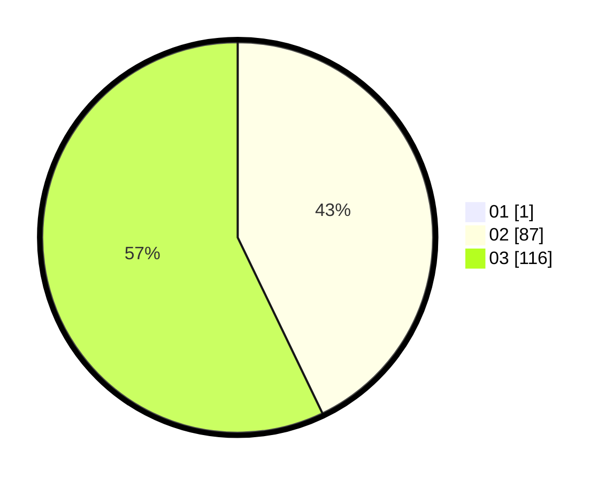

# Hasil

Hasil perolehan suara paslon dapat dilihat pada file paslon-01.txt, paslon-02.txt, dan paslon-03.txt.

Jika tidak ada, artinya data tersebut belum ada pada SIREKAP.

## Perolehan Suara

 * Paslon 01: **1**.
 * Paslon 02: **87**.
 * Paslon 03: **116**.

## Foto C Plano

https://sirekap-obj-formc.kpu.go.id/df7e/pemilu/ppwp/31/72/02/10/03/3172021003120-20240214-184531--25c55322-7c3e-4668-b30c-595e12f31b78.jpg

https://sirekap-obj-formc.kpu.go.id/df7e/pemilu/ppwp/31/72/02/10/03/3172021003120-20240214-184703--a7728b70-aaf5-40cf-8dbc-bcbbe9f841ca.jpg
