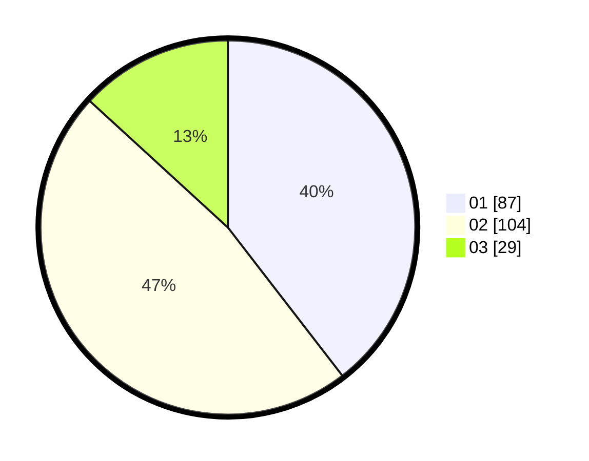

# Hasil

Hasil perolehan suara paslon dapat dilihat pada file paslon-01.txt, paslon-02.txt, dan paslon-03.txt.

Jika tidak ada, artinya data tersebut belum ada pada SIREKAP.

## Perolehan Suara

 * Paslon 01: **87**.
 * Paslon 02: **104**.
 * Paslon 03: **29**.

## Foto C Plano

https://sirekap-obj-formc.kpu.go.id/45b9/pemilu/ppwp/31/72/02/10/04/3172021004004-20240216-153151--5ced9065-b0f2-4951-a661-94e738799834.jpg

https://sirekap-obj-formc.kpu.go.id/45b9/pemilu/ppwp/31/72/02/10/04/3172021004004-20240216-155351--5fbc4883-0291-4ef9-880a-daf6b1341986.jpg

https://sirekap-obj-formc.kpu.go.id/45b9/pemilu/ppwp/31/72/02/10/04/3172021004004-20240216-154502--d719ec73-4f90-460d-954a-9e4d486c2f0f.jpg
