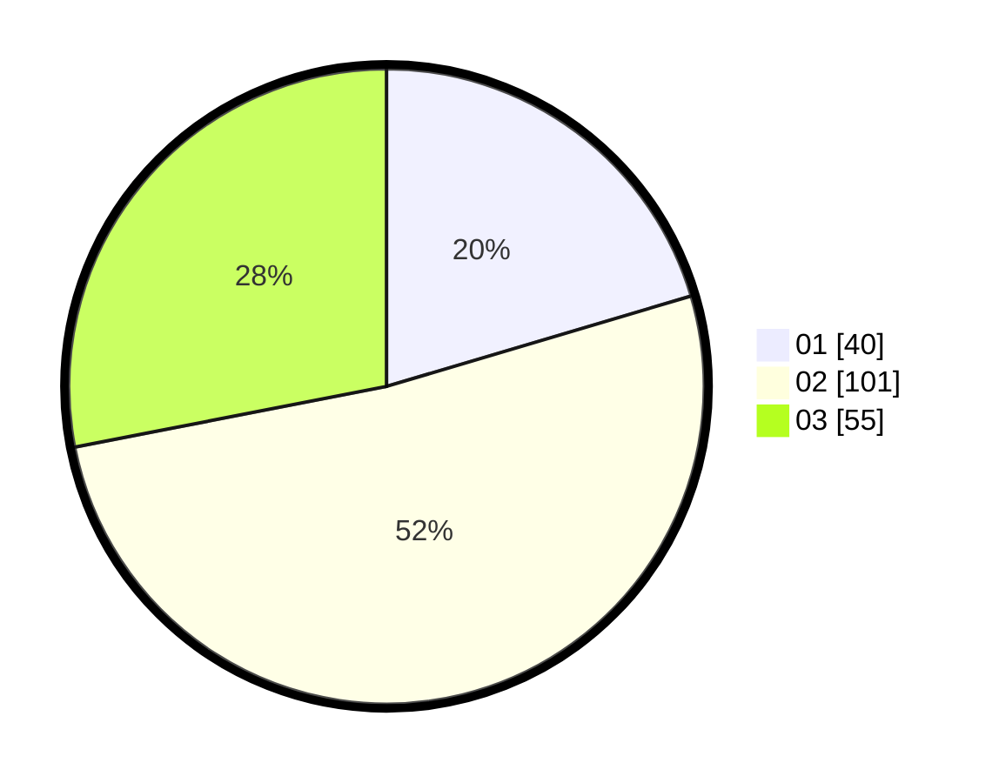

# Hasil

Hasil perolehan suara paslon dapat dilihat pada file paslon-01.txt, paslon-02.txt, dan paslon-03.txt.

Jika tidak ada, artinya data tersebut belum ada pada SIREKAP.

## Perolehan Suara

 * Paslon 01: **40**.
 * Paslon 02: **101**.
 * Paslon 03: **55**.

## Foto C Plano

https://sirekap-obj-formc.kpu.go.id/4641/pemilu/ppwp/31/72/02/10/04/3172021004006-20240216-180132--620b7ca7-3b57-4db5-b5ad-404a24060c05.jpg

https://sirekap-obj-formc.kpu.go.id/4641/pemilu/ppwp/31/72/02/10/04/3172021004006-20240216-175949--52e40c55-493d-4c1e-8c16-28a70d337579.jpg

https://sirekap-obj-formc.kpu.go.id/4641/pemilu/ppwp/31/72/02/10/04/3172021004006-20240216-175827--0bc447c7-e2a5-4d26-9596-18c5a3ed6a55.jpg

## DATA PEMILIH TETAP

Jumlah pemilih dalam DPT: **289**.
 * L: **136**.
 * P: **153**.

## DATA PENGGUNA HAK PILIH

Jumlah pengguna hak pilih dalam DPT: **193**.
 * L: **83**.
 * P: **110**.

Jumlah pengguna hak pilih dalam DPTb: **1**.
 * L: **0**.
 * P: **1**.

Jumlah pengguna hak pilih dalam DPK: **6**.
 * L: **4**.
 * P: **2**.

Jumlah pengguna hak pilih: **200**.
 * L: **87**.
 * P: **113**.

## JUMLAH SUARA SAH DAN TIDAK SAH

JUMLAH SELURUH SUARA SAH: **196**.

JUMLAH SUARA TIDAK SAH: **4**.

JUMLAH SELURUH SUARA SAH DAN SUARA TIDAK SAH: **200**.
